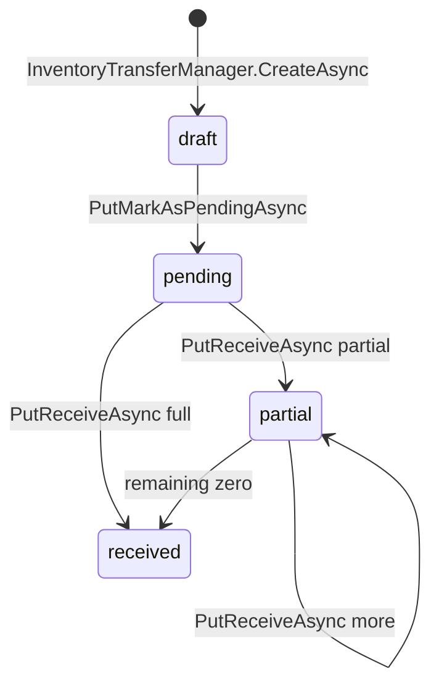
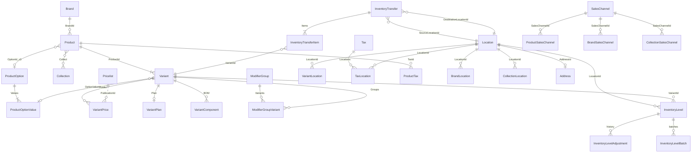
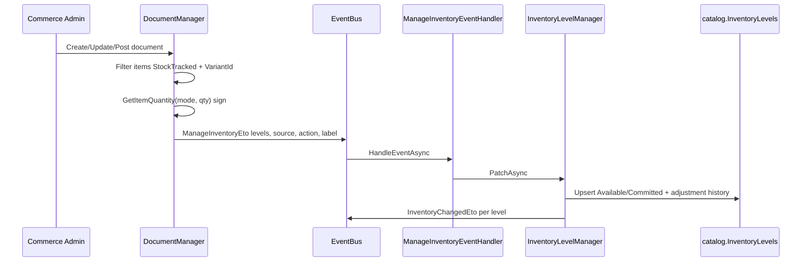

# Catalog, Inventory & Commerce Masters — Portable Implementation Specification

Extracted read-only from the Zahy Platform codebase for re-implementation in a separate Partner Platform repository. All field lists and rules cite source paths under `catalog/` and `commerce/`. Items not directly verified in code are marked **NOT VERIFIED IN CODE**.

---

## Ownership Verdict

| Area | Verdict | Evidence |
|------|---------|----------|
| **Catalog** | **[OWNED SOURCE in this repo]** | Full tree at `catalog/` (`src/core`, `src/admin`, `src/public`, `src/integration`, `host/`, `test/`). |
| **Inventory** | **[OWNED SOURCE — namespace inside Catalog]** | `catalog/src/core/Catalog.Domain/Catalog/Inventory/`. Schema `catalog`, connection string `"Catalog"`. |
| **Commerce masters (Location, Tax, SalesChannel)** | **[OWNED SOURCE in this repo]** | `commerce/src/core/Commerce.Domain/Commerce/`. Schema `commerce`, connection string `"Commerce"`. |
| **Cross-module link** | **Guid FKs + distributed events only** | Catalog domain has **no** project reference to Commerce; `DocumentManager` publishes `ManageInventoryEto` (`Catalog.Domain.Shared`). |
| **Deployment mix** | **[MIXED — packaging only]** | `ecommerce-server` uses **ProjectReference** to catalog source; `commerce/host/Commerce.HttpApi.Host` may consume **Catalog.* 2.1.0** NuGet (same published code). |

---

## Platform Context

| Item | Catalog | Commerce |
|------|---------|----------|
| Runtime | .NET 10, ABP 10.3 | Same |
| DB schema | `catalog` | `commerce` |
| Connection string name | `"Catalog"` | `"Commerce"` |
| Multi-tenancy | `Guid? TenantId` on all entities | Same |

### Audit bases (ABP)

- **`FullAuditedAggregateRoot<Guid>`:** `Id`, `TenantId?`, `CreationTime`, `CreatorId?`, `LastModificationTime?`, `LastModifierId?`, `IsDeleted`, `DeleterId?`, `DeletionTime?`, `ExtraProperties`.
- **Soft-deleted `Entity<Guid>`** (junction/history): `Id`, `TenantId?`, `CreationTime`, `CreatorId?`, `IsDeleted`, `DeleterId?`, `DeletionTime?`.
- **`ProductTranslation`:** composite PK `(ProductId, Language)` via `GetKeys()` — DbSet commented out in `CatalogDbContext`.

### Decimal precision

| Use | Precision | Scale | Source |
|-----|-----------|-------|--------|
| Catalog money (price, cost) | 18 | 4 | `CatalogDbProperties` |
| Catalog inventory qty | 18 | 6 | `CatalogDbProperties` |
| Commerce money / tax rate | 18 | 4 / 9 | 4 | `CommerceDbProperties` |

---

## 1. Catalog Module

All tables in schema **`catalog`** (e.g. `catalog.Products`). Source: `catalog/src/core/Catalog.Domain/Catalog/`.

### 1.1 Product (aggregate)

**File:** `Products/Product.cs` · **PK:** `Id` (Guid)

| Field | Type | Notes |
|-------|------|-------|
| Name | string (required) | |
| Handle | string? | URL slug |
| SubTitle, PromotionTitle | string? | |
| Description, HtmlDescription | string? | |
| Thumbnail | string? | |
| MetaTitle, MetaDescription | string? | SEO |
| PricingModel | enum | `Onetime`, `Recuring` (typo in source) |
| Status | string (required) | `draft`, `active`, `disabled`, `archived` (comments) |
| BrandId | Guid? | FK → Brand |
| OptionId, Option2Id, Option3Id | Guid? | FK → ProductOption |
| Sorting | int | |

**Navigation:** Brand, Collects, Options (×3), Variants, Medias, SalesChannels, Taxes

### 1.2 Variant (child of Product; aggregate root in EF)

**File:** `Products/Variant.cs`

| Field | Type | Notes |
|-------|------|-------|
| ProductId | Guid | FK → Product |
| Sku, Barcode | string? | Uniqueness via `ProductManager` |
| Calories | decimal | |
| Unit | string? | |
| Weight, Width, Height, Length | decimal | Weight comment: default kg |
| PreparationTime | int | |
| OptionValueId, Option2ValueId, Option3ValueId | Guid? | FK → ProductOptionValue |
| Sellable, Purchasable, Disabled | bool | |
| Sorting | int | |
| HasModifierGroups | bool | |
| MinQuantity, MaxQuantity | decimal? | |
| HasOffers | bool | TODO — not implemented |
| InventoryPolicy | enum | `Deny`, `Continue` |
| StockTracked | bool | If false, cannot add inventory levels |
| Cost | decimal | Used in valuation reports |
| IsPhysical | bool | |

**Computed:** `Name` from option values (`Variant.GetName`).

**Navigation:** Product, option values, Plan, Prices, Components, ParentVariants, ModifierGroups, Locations

### 1.3 Brand (aggregate)

**File:** `Brands/Brand.cs`

| Field | Type |
|-------|------|
| Name | string (required) |
| Image, Cover | string? |
| Handle | string? |
| Status | string (required) |
| Sorting | int |
| Description, HtmlDescription | string? |
| MetaTitle, MetaDescription | string? |

**Navigation:** BrandLocation, BrandSalesChannel

### 1.4 Collection (aggregate)

**File:** `Collections/Collection.cs`

| Field | Type | Notes |
|-------|------|-------|
| ParentId | Guid? | Self-FK hierarchy |
| Name | string (required) | |
| Type | string (required) | Default `"manual"`; smart collections TODO |
| Image, Cover, Handle | string? | |
| Description, HtmlDescription | string? | |
| MetaTitle, MetaDescription | string? | |
| Status | string (required) | |
| Sorting | int | |

**Navigation:** Parent, children, Collects, CollectionLocation, CollectionSalesChannel

### 1.5 Collect (M:N Product ↔ Collection)

**File:** `Collections/Collect.cs` — `ProductId`, `CollectionId`, `Sorting`

### 1.6 ProductOption / ProductOptionValue

**ProductOption** (`ProductOptions/ProductOption.cs`): `Name`, `Type` (`text` \| `color`), `Sorting`, `Values`

**ProductOptionValue**: `ProductOptionId`, `Value`, `Color?`, `Sorting`

### 1.7 Pricelist (aggregate)

**File:** `Pricelists/Pricelist.cs`

| Field | Type | Notes |
|-------|------|-------|
| ExternalId | string? | |
| Status | string (required) | `draft`, `active`, `archived` |
| Name | string (required) | |
| Currency | string? | |
| Adjustment | decimal | Markup/markdown % |
| Description | string? | |

### 1.8 Pricing entities

**VariantPrice** (`Products/VariantPrice.cs`)

| Field | Type | Notes |
|-------|------|-------|
| VariantId | Guid | |
| Price, CompareAtPrice | decimal | |
| Currency | string? | |
| PublicationId | Guid? | Location, pricelist, or sales channel ID |

**Default price:** `IsDefaultPrice()` → `!PublicationId && Currency` empty.

**VariantPriceAdjustment** — history row: `VariantPriceId`, `PriceAdjustment`, `Price`, `Currency`, `PublicationId`, `Reason`, `Source`, `SourceId`, `Action`, `SourceLabel`, `ExternalId`

**VariantPlan** (recurring): `VariantId`, `TrialDays`, `IntervalUnit` (`day`/`week`/`month`/`year`), `Interval`

**VariantComponent** (BOM): `VariantId`, `ComponentId` (another Variant), `Quantity`, `Sorting`

### 1.9 ProductMedia

**File:** `Products/ProductMedia.cs` — `Name`, `Type` (`image`|`video`), `Url`, `Size`, `Extension`, `Alt`, `Width`, `Height`, `Sorting`, `ProductId?`, `VariantIds?` (string)

### 1.10 ModifierGroup / ModifierGroupVariant

**ModifierGroup** (`Modifiers/ModifierGroup.cs`): `ExternalId`, `InternalName`, `Name`, `Description`, `Min`, `Max`, `Status`

**ModifierGroupVariant**: `ModifierGroupId`, `VariantId`, `Type` (`variant`|`group`), `Sorting`

### 1.11 Catalog junction tables (Guid FKs to Commerce — no DB FK constraint in catalog schema)

| Entity | FK fields | Purpose |
|--------|-----------|---------|
| VariantLocation | VariantId, LocationId, Disabled | Variant sold/stocked at location |
| ProductTax | ProductId, TaxId | Product tax assignment |
| ProductSalesChannel | ProductId, SalesChannelId, ScheduleDate? | Product channel availability |
| BrandLocation | BrandId, LocationId, Disabled | Brand scoped to location |
| BrandSalesChannel | BrandId, SalesChannelId | Brand scoped to channel |
| CollectionLocation | CollectionId, LocationId, Disabled | Collection scoped to location |
| CollectionSalesChannel | CollectionId, SalesChannelId | Collection scoped to channel |

### 1.12 Catalog enums (`Catalog.Domain.Shared`)

| Enum | Values | File |
|------|--------|------|
| PricingModel | Onetime, Recuring | `Products/PricingModel.cs` |
| InventoryPolicy | Deny, Continue | `Products/InventoryPolicy.cs` |

Status fields on Product, Brand, Collection, ModifierGroup, Pricelist are **plain strings**, not enums.

### 1.13 Key catalog business rules

| Rule | Source | Description |
|------|--------|-------------|
| Unique handle | `ProductManager.GenerateHandleAsync` | Slugify; append `-2`, `-3`… |
| Unique name (optional) | `ProductSettingManager` + `ProductManager.NameExistsAsync` | Setting `Catalog.Products.EnforceUniqueName` |
| SKU / barcode uniqueness | `ProductManager.SKUsExistAsync`, `BarcodesExistAsync` | Settings for enforce/bypass |
| Default price | `ProductManager.GetDefaultPrice` | No PublicationId, null Currency |
| StockTracked gate | `ProductAppService.ValidateCreateAsync` | No InventoryLevels when StockTracked false |
| Recurring requires plan | `ProductAppService.ValidateCreateAsync` | `PricingModel.Recuring` → variant needs Plan |
| Initial inventory | `ProductAppService.PopulateNewVariantAsync` | Publishes `ManageInventoryEto` (Source=Variant, Action=Created) |
| Integration stock check | `ProductIntegrationService` | Deny + StockTracked: qty vs Available at LocationId |
| Delete location levels | `ProductAppService` ~955 | Publishes `DeleteLocationInventoryLevelsEto`; handled by `DeleteInventoryLevelEventHandler` |

---

## 2. Inventory Module (within Catalog)

Source: `catalog/src/core/Catalog.Domain/Catalog/Inventory/` and `Catalog.Domain.Shared/Catalog/Inventory/`.

### 2.1 InventoryLevel (aggregate)

**File:** `Inventory/InventoryLevel.cs` · **Table:** `catalog.InventoryLevels`

| Field | Type | Notes |
|-------|------|-------|
| LocationId | Guid | References Commerce Location (logical FK) |
| VariantId | Guid | |
| Available | decimal | Private setter; delta or reset via manager |
| Committed | decimal | Reserved for orders |
| Low | decimal | Reorder threshold |
| Optimal | decimal | Target stock |

**Navigation:** Adjustments, Batches

**Business key:** `(VariantId, LocationId)` looked up in `InventoryLevelManager.PatchAsync`. **NOT VERIFIED IN CODE:** DB unique index.

### 2.2 InventoryLevelAdjustment (history)

**File:** `InventoryLevelAdjustment.cs` · **Table:** `catalog.InventoryLevelAdjustments`

| Field | Type |
|-------|------|
| InventoryLevelId | Guid |
| AvailableAdjustment, Available | decimal |
| CommittedAdjustment, Committed | decimal |
| Reason, Source, SourceId, Action, SourceLabel | string? |
| ExternalId | string? |

`Incoming` quantity — **TODO in source (not implemented)**.

### 2.3 InventoryLevelBatch

**File:** `InventoryLevelBatch.cs` · **Table:** `catalog.InventoryLevelBatches`

| Field | Type |
|-------|------|
| InventoryLevelId | Guid |
| Number | string? |
| Quantity, InitialQuantity | decimal |
| ExpiryDate, ProductionDate | DateTime? |
| Cost | decimal |

App-layer create/update paths — **NOT VERIFIED IN CODE** (entity + EF only).

### 2.4 InventoryTransfer (aggregate)

**File:** `InventoryTransfer.cs` · **Table:** `catalog.InventoryTransfers`

| Field | Type | Notes |
|-------|------|-------|
| Number | string (required) | Sequential; fallback `"10000"` on repo error |
| Status | string (required) | See state machine below |
| Date | DateTime | |
| SourceLocationId, DestinationLocationId | Guid | |
| TotalQuantityOfItems | int | Sum of line Quantity |
| ReceivedQuantityOfItems | int | Sum Accepted + Rejected |
| Note | string? | |

**Computed:** `RemainingQuantityOfItems = Total - Received`

### 2.5 InventoryTransferItem

**File:** `InventoryTransferItem.cs`

| Field | Type |
|-------|------|
| InventoryTransferId | Guid |
| VariantId | Guid |
| Quantity | int |
| AcceptedQuantity, RejectedQuantity | int |

**Computed:** `RemainingQuantity = Quantity - Accepted - Rejected`

### 2.6 Inventory enums & request DTOs

**InventorySource** (`InventorySource.cs`):

| Value | Name |
|-------|------|
| 10 | Variant |
| 20 | PurchaseOrder |
| 21 | ReturnPurchaseOrder |
| 30 | PurchaseBill |
| 31 | ReturnPurchaseBill |
| 40 | SalesOrder |
| 41 | ReturnSalesOrder |
| 50 | SalesInvoice |
| 51 | ReturnSalesInvoice |
| 60 | InventoryTransfer |
| 70 | InventoryCount |

**InventoryAction** (`InventoryAction.cs`): Created, Updated, Posted, Canceled, Received, Sent, Manual

**UpdateInventoryLevelRequest** (`UpdateInventoryLevelRequest.cs`): VariantId, LocationId, Low?, Available?, Committed?, Reset?, Optimal?, Reason?, Source?, SourceId?, Action?, Label?

### 2.7 Transfer state machine

Status strings from `InventoryTransfer.cs` comments and `InventoryTransferAppService.cs`:



| Transition | Inventory effect | Source |
|------------|------------------|--------|
| draft → pending | Deduct `Available` at **source** (ManageInventoryEto, Action=Sent) | `PutMarkAsPendingAsync` |
| receive | Add `Available` at **destination**; deduct at **source** by accepted qty | `PutReceiveAsync` |
| draft edit | Locations/items editable | `MapToEntityAsync` when Status=draft |
| partial/received edit | Comment: note/date only; items locked | **NOT VERIFIED IN CODE** server enforcement on CRUD |

### 2.8 Inventory business rules

| Rule | Source | Description |
|------|--------|-------------|
| Patch upsert | `InventoryLevelManager.PatchAsync` | Match (LocationId, VariantId); create or delta; history row |
| Reset mode | `UpdateInventoryLevelAsync` | `Reset=true` → absolute set for Available/Committed |
| ManageInventory handler | `ManageInventoryEventHandler` | `ManageInventoryEto` → `PatchAsync` |
| InventoryChanged event | `InventoryLevelManager.PatchAsync` | Publishes `InventoryChangedEto` (`inventoryLevel.changed`); ProductId TODO |
| Delete by location | `DeleteInventoryLevelEventHandler` | On `DeleteLocationInventoryLevelsEto` |
| Available sum | `GetVariantsAvailableQuantities` | Sum Available per VariantId (optional location filter) |
| Valuation | `InventoryAppService.GetValuationSummaryAsync` | Sum(Cost × Available) — not on interface |

---

## 3. Commerce Core Masters

Source: `commerce/src/core/Commerce.Domain/Commerce/`. Schema **`commerce`**.

Catalog and Inventory store **Guid references only** — no cross-database FK. Partner Platform must implement compatible masters (or stubs with stable IDs).

### 3.1 Location (aggregate)

**File:** `Locations/Location.cs` · **Table:** `commerce.Locations`

| Field | Type | Notes |
|-------|------|-------|
| ExternalId | string? | |
| Name | string | |
| Status | string | Status vocabulary **NOT VERIFIED IN CODE** as enum (string in entity) |
| InventoryType | LocationInventoryType | See enum below |
| AddressId | Guid? | FK → Address (1:1) |
| BillingAddressId | Guid? | FK → Address; null = same as Address |
| EnabledForOnlineOrders | bool | Fulfill online orders from this location |
| CompanyName, CompanyNumber, Industry | string? | |
| TaxNumber | string? | VAT number |
| Logo | string? | |

**LocationInventoryType** (`Commerce.Domain.Shared/Locations/LocationInventoryType.cs`):

| Value | Meaning |
|-------|---------|
| Actual | Has inventory levels |
| Assembly | Commented out in enum — TODO: shares stock from other warehouses |

**Used by Catalog/Inventory as:** `InventoryLevel.LocationId`, `InventoryTransfer.SourceLocationId` / `DestinationLocationId`, `VariantLocation.LocationId`, all `*Location` junction tables, `TaxLocation.LocationId`, and Commerce `Document.LocationId` for inventory events.

### 3.2 Tax (aggregate)

**File:** `Taxes/Tax.cs` · **Table:** `commerce.Taxes`

| Field | Type | Notes |
|-------|------|-------|
| Name | string | |
| Type | TaxPriceType | Included / Excluded |
| Rate | decimal | Percent; EF precision 9,4 |
| Status | string (required) | `draft`, `active`, `disabled`, `archived` (comment) |

**Navigation:** `Locations` (TaxLocation collection)

**TaxPriceType** (`Commerce.Integration.Domain.Shared/.../TaxPriceType.cs` — also used in domain):

| Value | Meaning |
|-------|---------|
| Included | Tax included in price |
| Excluded | Tax added to price |

### 3.3 TaxLocation (Tax ↔ Location junction)

**File:** `Taxes/TaxLocation.cs` · **Table:** `commerce.TaxLocations`

| Field | Type |
|-------|------|
| TaxId | Guid |
| LocationId | Guid |
| Disabled | bool |

Commerce assigns which taxes apply at which location. Catalog `ProductTax` links products to `TaxId` (product-level assignment); effective tax at checkout combines both — **NOT VERIFIED IN CODE** full resolution algorithm in this extract.

### 3.4 SalesChannel (aggregate)

**File:** `Sales/SalesChannel.cs` · **Table:** `commerce.SalesChannels`

| Field | Type | Notes |
|-------|------|-------|
| Name | string (required) | |
| Type | string (required) | Free-form string in entity; allowed values **NOT VERIFIED IN CODE** as enum |
| Slug | string (required) | Lookup via `SalesChannelManager.GetSalesChannelBySlugAsync` (lowercase) |
| ExternalId | string? | |
| Status | string (required) | `draft`, `active`, `disabled`, `archived` (comment) |

**Used by Catalog as:** `ProductSalesChannel`, `BrandSalesChannel`, `CollectionSalesChannel`, and optionally `VariantPrice.PublicationId`.

### 3.5 Address (referenced by Location)

**File:** `Geo/Address.cs` · **Table:** `commerce.Addresses` (per EF migrations)

Required fields per class comment: Name, Country, City (CityName), Line1.

| Field | Type | Notes |
|-------|------|-------|
| Label, ShortAddress | string? | |
| Name, Email, Phone, Company | string? | |
| Country | string | ISO 3166-1 alpha-2 |
| RegionId, CityId, AreaId | Guid? | FK → GeoArea |
| RegionName, CityName, AreaName, Code | string? | |
| Line1, Line2 | string | Street / building |
| Note, Longitude, Latitude, Accuracy | | |
| OwnerId, OwnerType | | Polymorphic owner |

**Computed:** `Formatted`, `ShortFormatted` (not persisted).

Address is **not** referenced directly from Catalog entities; only via Location.

### 3.6 Related Commerce master (not Catalog FK)

**Store** (`Stores/Store.cs`) — tenant store settings (Name, Country, Currency, Locales). **No direct Catalog FK** in domain entities reviewed. Listed for context only.

---

## 4. Relationships & Data Flow

### 4.1 Entity-relationship (Catalog + Inventory + Commerce masters)



**Note:** Lines from Catalog junction entities to Commerce masters are **logical** (Guid only). No cross-schema EF FK from `catalog.*` to `commerce.*`.

### 4.2 How catalog/inventory data reflects through Commerce

Commerce **documents** (orders, invoices, purchase bills) drive inventory via distributed events. Catalog **does not** call Commerce; Commerce publishes `ManageInventoryEto`; Catalog's `ManageInventoryEventHandler` applies patches.



**Document quantity sign** (`DocumentManager.GetItemQuantity`):

| Document modes | Effect on delta |
|----------------|-----------------|
| BeginningInvoice, ReturnPurchaseOrder, ReturnPurchaseBill, SalesOrder, SalesInvoice | Negative (decrease Available / increase outbound) |
| PurchaseOrder, PurchaseBill, ReturnSalesOrder, ReturnSalesInvoice, default | Positive (increase stock) |

**Update kind** (`PublishInventoryEventAsync`):

| Method | Available | Committed |
|--------|-----------|-----------|
| PublishAvailableInventoryEventAsync | delta | — |
| PublishCommittedInventoryEventAsync | — | delta |
| PublishAvailableAndReleaseCommittedInventoryEventAsync | delta | -delta |
| PublishFulfilledInventoryEventAsync | delta | delta |

### 4.3 Verified Commerce → Catalog inventory call sites

| Trigger | Source file | InventorySource | InventoryAction | Update kind |
|---------|-------------|-----------------|-----------------|-------------|
| Sales order created (not fulfilled) | `DocumentCreatedHandler.PublishInventoryAsync` | SalesOrder | Created | Committed |
| Sales order created (already fulfilled) | Same | SalesOrder | Created | Available |
| Order fulfilled/posted | `OrderAppService` ~423 | SalesOrder | Posted | Available + Committed |
| Return sales order created | `ReturnOrderAppService` ~168 | ReturnSalesOrder | Created | Available |
| Sales invoice created | `InvoiceAppService` ~341 | SalesInvoice | Created | Available |
| Sales invoice updated | `InvoiceAppService` ~644 | SalesInvoice | Updated | Available (custom etos) |
| Return sales invoice created | `ReturnInvoiceAppService` ~144 | ReturnSalesInvoice | Created | Available |
| Purchase bill created | `BillAppService` ~256 | PurchaseBill | Created | Available |
| Purchase bill updated | `BillAppService` ~478 | PurchaseBill | Updated | Available |
| Transfer mark pending | `InventoryTransferAppService` | InventoryTransfer | Sent | Available (catalog admin) |
| Transfer receive | `InventoryTransferAppService` | InventoryTransfer | Received / Sent | Available |
| Product variant create with levels | `ProductAppService` | Variant | Created | Available |
| Manual bulk patch | `InventoryAppService.PatchBulkAsync` | — (no source in DTO) | — | Available/Committed |

**NOT VERIFIED IN CODE** as Commerce call sites in this pass: PurchaseOrder, ReturnPurchaseOrder/Bill, InventoryCount, `PublishAvailableAndReleaseCommittedInventoryEventAsync` (method exists; no callers found).

**VariantPrice.PublicationId** may reference Location, Pricelist, or SalesChannel ID — resolution logic **NOT VERIFIED IN CODE** beyond default-price rule.

---

## 5. Sample Records (anonymized)

### 5.1 Catalog

**Product**

```json
{
  "id": "a1b2c3d4-e5f6-7890-abcd-ef1234567890",
  "tenantId": "11111111-1111-1111-1111-111111111111",
  "name": "Arabic Coffee Blend",
  "handle": "arabic-coffee-blend",
  "status": "active",
  "pricingModel": "Onetime",
  "brandId": "22222222-2222-2222-2222-222222222222",
  "sorting": 10
}
```

**Variant**

```json
{
  "id": "b2c3d4e5-f6a7-8901-bcde-f12345678901",
  "productId": "a1b2c3d4-e5f6-7890-abcd-ef1234567890",
  "sku": "COF-250-G",
  "barcode": "6281000123456",
  "stockTracked": true,
  "inventoryPolicy": "Deny",
  "cost": 18.5000,
  "sellable": true,
  "isPhysical": true,
  "weight": 0.250
}
```

**VariantPrice (default)**

```json
{
  "variantId": "b2c3d4e5-f6a7-8901-bcde-f12345678901",
  "price": 45.0000,
  "compareAtPrice": 55.0000,
  "currency": null,
  "publicationId": null
}
```

**ModifierGroup**

```json
{
  "id": "e5f6a7b8-c9d0-1234-ef01-345678901234",
  "internalName": "coffee-addons",
  "name": "Add-ons",
  "min": 0,
  "max": 3,
  "status": "active"
}
```

**Collect**

```json
{
  "productId": "a1b2c3d4-e5f6-7890-abcd-ef1234567890",
  "collectionId": "33333333-3333-3333-3333-333333333333",
  "sorting": 1
}
```

### 5.2 Inventory

**InventoryLevel**

```json
{
  "id": "c3d4e5f6-a7b8-9012-cdef-123456789012",
  "variantId": "b2c3d4e5-f6a7-8901-bcde-f12345678901",
  "locationId": "44444444-4444-4444-4444-444444444444",
  "available": 120.000000,
  "committed": 5.000000,
  "low": 10.000000,
  "optimal": 100.000000
}
```

**InventoryLevelAdjustment**

```json
{
  "inventoryLevelId": "c3d4e5f6-a7b8-9012-cdef-123456789012",
  "availableAdjustment": -2.000000,
  "available": 118.000000,
  "committedAdjustment": 0,
  "committed": 5.000000,
  "source": "SalesInvoice",
  "sourceId": "doc-invoice-guid",
  "action": "Created",
  "sourceLabel": "INV-10042"
}
```

**InventoryLevelBatch**

```json
{
  "inventoryLevelId": "c3d4e5f6-a7b8-9012-cdef-123456789012",
  "number": "LOT-2026-001",
  "quantity": 50.000000,
  "initialQuantity": 50.000000,
  "expiryDate": "2026-12-31T00:00:00Z",
  "cost": 17.2500
}
```

**InventoryTransfer**

```json
{
  "id": "d4e5f6a7-b8c9-0123-def0-234567890123",
  "number": "10001",
  "status": "pending",
  "date": "2026-06-01T10:00:00Z",
  "sourceLocationId": "44444444-4444-4444-4444-444444444444",
  "destinationLocationId": "55555555-5555-5555-5555-555555555555",
  "totalQuantityOfItems": 50,
  "receivedQuantityOfItems": 0,
  "items": [
    {
      "variantId": "b2c3d4e5-f6a7-8901-bcde-f12345678901",
      "quantity": 50,
      "acceptedQuantity": 0,
      "rejectedQuantity": 0
    }
  ]
}
```

### 5.3 Commerce masters

**Location**

```json
{
  "id": "44444444-4444-4444-4444-444444444444",
  "name": "Riyadh Warehouse",
  "status": "active",
  "inventoryType": "Actual",
  "enabledForOnlineOrders": true,
  "taxNumber": "300000000000003",
  "addressId": "66666666-6666-6666-6666-666666666666"
}
```

**Tax**

```json
{
  "id": "77777777-7777-7777-7777-777777777777",
  "name": "VAT 15%",
  "type": "Excluded",
  "rate": 15.0000,
  "status": "active",
  "locationIds": ["44444444-4444-4444-4444-444444444444"]
}
```

**SalesChannel**

```json
{
  "id": "88888888-8888-8888-8888-888888888888",
  "name": "Point of Sale",
  "type": "pos",
  "slug": "pos",
  "status": "active"
}
```

**Note:** Sample `SalesChannel.type` value `"pos"` is illustrative — allowed `Type` values are **NOT VERIFIED IN CODE** as a closed enum.

**ProductTax junction (Catalog)**

```json
{
  "productId": "a1b2c3d4-e5f6-7890-abcd-ef1234567890",
  "taxId": "77777777-7777-7777-7777-777777777777"
}
```

---

## 6. Portable vs Commerce-Dependent

### Portable (copy/re-implement from `catalog/` source)

- All Catalog domain entities, managers, EF model, admin/public/integration app services
- Inventory patch logic, transfer workflow, adjustment history
- Distributed ETOs: `ManageInventoryEto`, `InventoryChangedEto`, `DeleteLocationInventoryLevelsEto`
- Settings keys under `CatalogSettings`, permissions under `CatalogAdminPermissions`
- Optional `public.indexed` read cache layer

### Portable from `commerce/` source (separate module, not vendor NuGet)

- Location, Tax, TaxLocation, SalesChannel, Address entity shapes
- `DocumentManager` inventory publishing behavior and verified call sites (table §4.3)
- Document modes and quantity sign rules

### Must be provided or stubbed in Partner Platform

| Dependency | Why |
|------------|-----|
| **Location** | Every `InventoryLevel`, transfer, `VariantLocation`, junction `*Location` |
| **Tax** | `ProductTax`; checkout tax resolution with Commerce |
| **SalesChannel** | Product/brand/collection channel junctions; optional price publication |
| **Address** | Location display and fulfillment (via Location) |
| **Commerce documents** | Orders/invoices/bills drive `ManageInventoryEto` in production Zahy topology |

### Framework / vendor (not domain source)

| Package | Role |
|---------|------|
| ABP 10.3 | Modularity, EF, events, auth |
| Slugify.Core | Product/brand handle generation |
| Tajer.Legacy | ecommerce-server only — unrelated to catalog schema |
| Catalog.* / Commerce.* NuGet | Published packages; prefer copying `catalog/` + `commerce/` trees |

---

## 7. Assumptions

1. Partner Platform uses `Guid? TenantId` per ABP multi-tenancy conventions.
2. Status strings are lowercase English tokens in storage (`active`, `draft`, …).
3. Default variant price = `VariantPrice` with null `Currency` and null `PublicationId`.
4. Inventory quantities use `decimal` (scale 6); transfer line `Quantity` uses `int`.
5. `InventoryPolicy.Continue` allows POS oversell (per Variant XML comment); online integration enforces Deny + available qty.
6. Commerce `Document.LocationId` is the inventory location for all document-driven patches.
7. Re-implementation may replace ABP conventional HTTP with equivalent REST contracts.

---

## 8. NOT VERIFIED IN CODE

- Exact HTTP routes for all admin/public/integration app services (requires OpenAPI or running host).
- `PutMarkAsPendingAsync` / `PutReceiveAsync` on `IInventoryTransferAppService` interface and permission attributes.
- `GetValuationSummaryAsync` on `IInventoryTransferAppService` / public contract exposure.
- `InventoryLevelBatch` app-service create/update flows.
- `ProductTranslation` active persistence (DbSet commented out).
- `ICatalogDbContext` missing DbSets for ModifierGroup, ModifierGroupVariant, InventoryLevelBatch vs EF configuration.
- MongoDB catalog persistence in production hosts.
- Full `public.indexed` Redis sync behavior.
- Pricelist price resolution in `ProductIntegrationService` (explicit TODO at line ~176).
- Smart/automated Collection type.
- Variant BOM and modifier wiring on product create (TODOs in `ProductAppService`).
- Single tax per location validation on product create (TODO).
- `PublishAvailableAndReleaseCommittedInventoryEventAsync` — no call sites found.
- PurchaseOrder / ReturnPurchaseOrder / ReturnPurchaseBill / InventoryCount Commerce inventory triggers.
- Closed enum for `SalesChannel.Type` allowed values.
- Closed enum for `Location.Status` allowed values.
- DB unique index on `(InventoryLevels.VariantId, InventoryLevels.LocationId)`.
- `InventoryChangedEto.ProductId` population (TODO in `InventoryLevelManager`).
- Incoming inventory quantity on adjustments and transfers (TODO comments).
- Full tax resolution at checkout (ProductTax + TaxLocation + document logic).
- `VariantPrice.PublicationId` discriminator (location vs pricelist vs channel) resolution rules.
- Public API remote service constants and gRPC surfaces.
- Feature flag names for Inventory/Export permissions.

---

## 9. Key Source Index

| Concern | Path |
|---------|------|
| Catalog entities | `catalog/src/core/Catalog.Domain/Catalog/` |
| Catalog shared enums/ETOs | `catalog/src/core/Catalog.Domain.Shared/Catalog/` |
| Catalog EF | `catalog/src/core/Catalog.EntityFrameworkCore/.../CatalogDbContextModelCreatingExtensions.cs` |
| Product rules | `catalog/.../Products/ProductManager.cs` |
| Inventory patch | `catalog/.../Inventory/InventoryLevelManager.cs` |
| Transfer workflow | `catalog/.../Admin/Inventory/InventoryTransferAppService.cs` |
| Event handlers | `catalog/.../ManageInventoryEventHandler.cs`, `DeleteInventoryLevelEventHandler.cs` |
| Integration validation | `catalog/.../Integration/Products/ProductIntegrationService.cs` |
| Commerce Location/Tax/Channel | `commerce/src/core/Commerce.Domain/Commerce/Locations/`, `Taxes/`, `Sales/` |
| Commerce inventory publisher | `commerce/.../Documents/DocumentManager.cs` |
| Order inventory on create | `commerce/.../Documents/Handlers/DocumentCreatedHandler.cs` |
| ecommerce-server catalog refs | `ecommerce-server/src/App.Application/App.Application.csproj` |

---

*Document completed read-only from repository source. No builds, migrations, or code changes were performed.*
