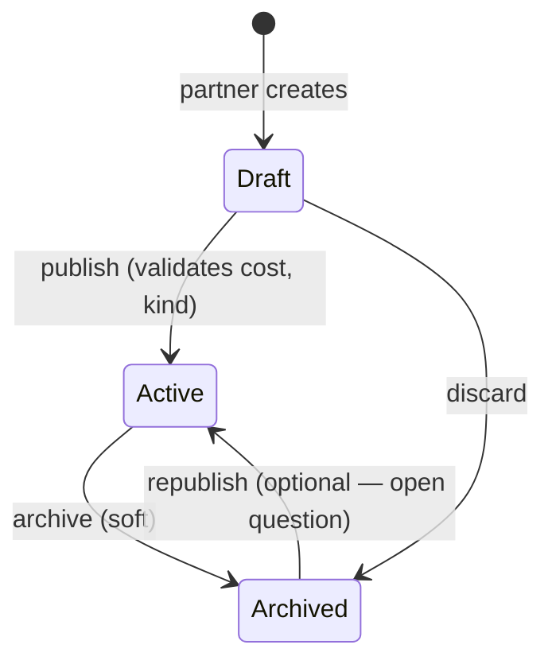
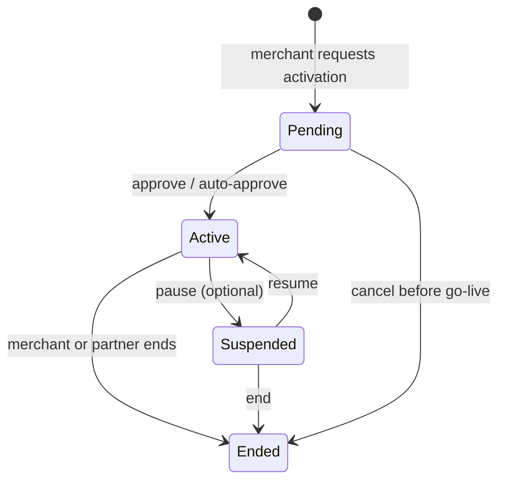
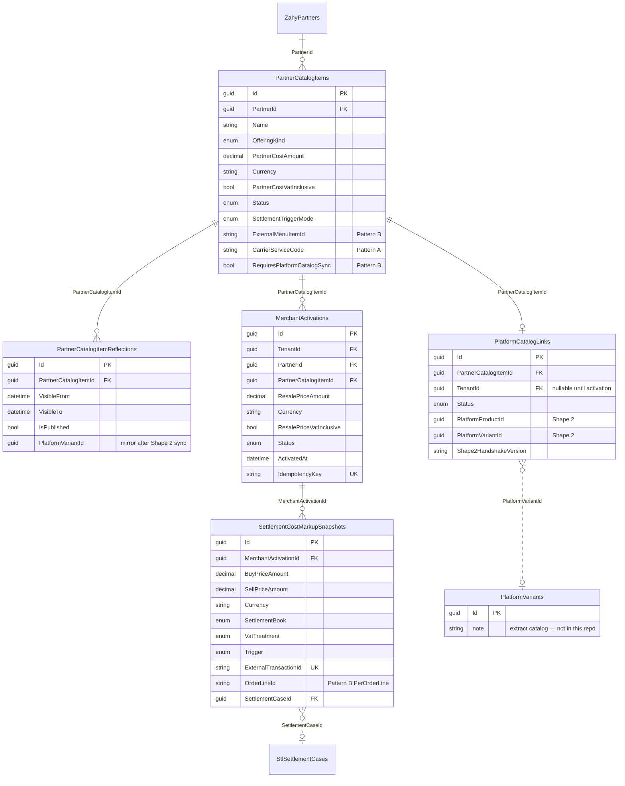
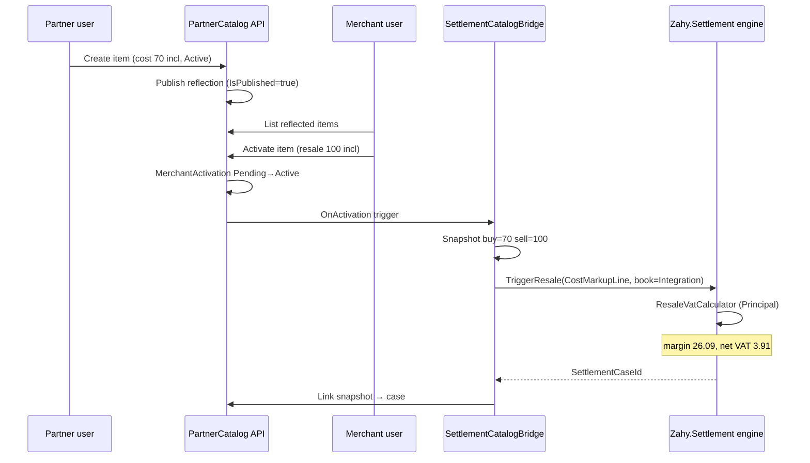
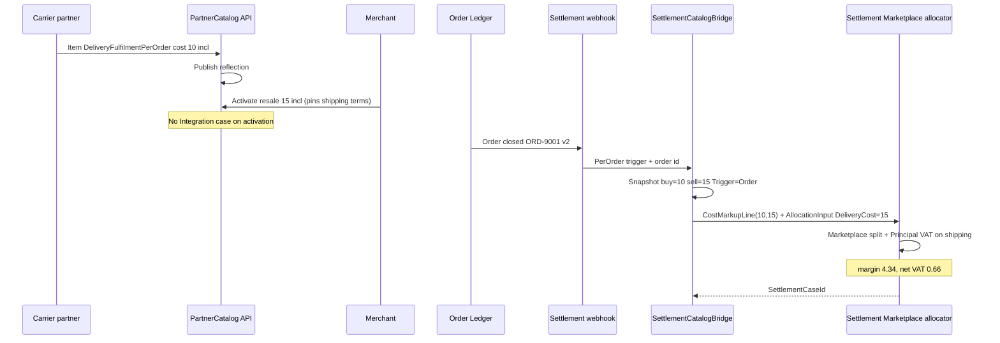

# Zahy Partner Catalog — Design (Shape 1)

**Status:** PROPOSAL — awaiting approval before any production code. **Accountant:** Principal VAT for all partner types/books confirmed (§3.1.2). **Pending:** Pattern B sell leg (§9.8, §11 A2).  
**Scope:** Partner-owned B2B2B catalog → merchant activation → settlement cost/price bridge. **Self-contained in this repo** (Shape 1). Does **not** live-sync to the main-platform product catalog (`docs/catalog-inventory-extract.md`) **except** Pattern **B** (F&B/items), where a **described-only** `PlatformCatalogLink` boundary is modeled now and wired in Shape 2+.  
**Grounding:** [`docs/settlement/DESIGN.md`](../settlement/DESIGN.md) (Money, CostMarkupLine, SettlementBook, flow profiles, round-per-line VAT).  
**Working rule:** Design only — no entities, migrations, or code in this phase.

---

## 1. Purpose & position in the platform

The settlement engine (P1–P4) can allocate journals when it receives a **buy/sell cost pair** (`CostMarkupLine` + `SettlementAllocationInput`). Today that pair is **stubbed or parsed from webhook payloads** — there is no owned upstream that says *why* buy = 70 and sell = 100.

**Partner Catalog** closes that gap:

| Layer | Question it answers |
|-------|---------------------|
| `PartnerCatalogItem` | What does the **partner** offer, at what **partner cost** (VAT-inclusive)? |
| Reflection | How does an **active** item become **visible** to merchants in Zahy Partner? |
| `MerchantActivation` | At what **resale price** (VAT-inclusive) did the **merchant** turn it on? |
| **Settlement bridge** | How does activation produce the **70 buy / 100 sell** pair the allocator consumes? |

This module is **not** the merchant→consumer catalog (Product/Variant/Inventory in the extract). See §8.

---

## 2. Two catalogs (explicit separation)

| | **Partner Catalog (this design)** | **Main-platform catalog (extract)** |
|---|-----------------------------------|-------------------------------------|
| **Direction** | Partner → Merchant (B2B2B) | Merchant → Consumer (B2C) |
| **Owner aggregate** | `PartnerCatalogItem` | `Product` / `Variant` |
| **Price semantics** | Partner **cost** + merchant **resale** | Variant **cost** + **sell price** to shopper |
| **Tenancy** | Partner-scoped (host) + merchant `TenantId` on activation | Merchant `TenantId` on all catalog rows |
| **Inventory** | Out of scope here (no stock levels) | `InventoryLevel`, transfers, Commerce-driven patches |
| **Settlement link** | **Direct** — activation → `CostMarkupLine` | Pattern **B** only: **described** `PlatformCatalogLink` → future Variant; settlement still via Partner Catalog snapshots |
| **Future relationship** | Pattern **B:** `PlatformCatalogLink` (Shape 1: `DeferredShape2`) | Consumes synced Variant when Shape 2 approved |

**Shape 1 rule:** Partner Catalog lives entirely in `Zahy.PartnerCatalog` schema. No live FK or sync job to `catalog.Products` **except** Pattern **B** (F&B/items), where a **described-only** `PlatformCatalogLink` boundary is modeled now and wired in Shape 2+. Merchants activate partner offerings independently of whether they also sell their own SKUs.

**Future main-platform surfacing (describe only):** Service items may appear as a read-only “Partner services” facet in core Zahy admin. **F&B/items (Pattern B)** are the one case intended to **eventually** surface as real `Product`/`Variant` rows in the main catalog (see §2.1, §5.3). Checkout continues to price from Commerce documents until Shape 2 sync is approved.

### 2.1 Review — does the prior doc separate delivery vs F&B aggregators?

**No.** The first draft used a single `AggregatorHandled` offering kind and §5.2/§9.7 treated all aggregators alike (activation pins terms → generic order webhook → `SettlementBook.Marketplace`). That **does not** distinguish:

| | **Pattern A — Delivery / logistics** | **Pattern B — F&B / items** |
|---|----------------------------------------|-----------------------------|
| **What the partner supplies** | Shipping / fulfilment of merchant orders | Menu items / SKUs that become consumer products |
| **Main platform catalog** | **No touch** — logistics only | **Described boundary only (Shape 1)** — items *will* map to `Product`/`Variant` |
| **Typical settlement unit** | **Per delivery / per order** shipping markup (e.g. 10→15) | **Per item sold / counted** on order lines tied to platform variant |
| **Primary settlement input** | `SettlementAllocationInput` + shipping `CostMarkupLine` | Order line subtotal + item markup; commission on subtotal (Order Ledger) |
| **Example partners** | Carrier, ThreePL-as-delivery, logistics aggregators | Jahez/HungerStation-style menu aggregators (`PartnerType.Aggregator`) |

**This revision** splits the enum, entities, flows, samples, and open questions accordingly.

---

## 3. Domain model

### 3.1 Enums (Domain.Shared)

```text
PartnerCatalogItemStatus       Draft | Active | Archived
PartnerCatalogOfferingKind     ServiceOneOff | ServiceSubscription | DeliveryFulfilmentPerOrder | FnBItemsPerSale
MerchantActivationStatus       Pending | Active | Suspended | Ended
SettlementTriggerMode          OnActivation | PerOrder | PerBillingPeriod | PerOrderLine
PlatformCatalogLinkStatus    NotApplicable | PendingSync | Synced | SyncFailed | DeferredShape2
```

**`PartnerCatalogOfferingKind`** — four commercial shapes (replaces monolithic `AggregatorHandled`):

| Kind | Pattern | Typical `PartnerType` (existing enum) | Settlement pattern |
|------|---------|--------------------------------------|-------------------|
| `ServiceOneOff` | — | `Service` | **OnActivation** → `CostMarkupLine` → `SettlementBook.Integration` |
| `ServiceSubscription` | — | `Service` | **PerBillingPeriod** → Integration resale |
| `DeliveryFulfilmentPerOrder` | **A** | `Carrier`, `ThreePL`, delivery-focused `Aggregator` | **PerOrder** → shipping markup (buy/sell) + `SettlementAllocationInput` → `SettlementBook.Marketplace` |
| `FnBItemsPerSale` | **B** | `Aggregator`, `Marketplace` (menu/item supply) | **PerOrderLine** (item sold/counted) → marketplace split + item-level markup snapshot |

**Mapping `PartnerType` → default offering kind (config, not hardcoded in domain):**

| `PartnerType` (PartnerPlatform) | Default `PartnerCatalogOfferingKind` | Pattern |
|---------------------------------|--------------------------------------|---------|
| `Service` | `ServiceOneOff` / `ServiceSubscription` | Integration |
| `Carrier` | `DeliveryFulfilmentPerOrder` | **A** |
| `ThreePL` | `DeliveryFulfilmentPerOrder` (fulfilment fee line; inventory is separate) | **A** |
| `Aggregator` | **`FnBItemsPerSale`** if menu/items; **`DeliveryFulfilmentPerOrder`** if logistics-only partner | **B** or **A** |
| `Marketplace` | **`FnBItemsPerSale`** (Model 2 item settlement) | **B** |

A single `PartnerType.Aggregator` partner may operate **both** patterns via **different catalog items** (different `OfferingKind` per item, not per partner subclass).

**`SettlementTriggerMode`** on the catalog item tells the bridge **when** to open a settlement case:

- `OnActivation` — first charge when merchant activates (service subscription setup fee, etc.).
- `PerOrder` — each **delivery/fulfilment order** referencing the activation (Pattern **A**).
- `PerOrderLine` — each **sold/counted item line** on an order (Pattern **B**); idempotency key includes platform variant id + order line id.
- `PerBillingPeriod` — monthly subscription tick (aligns with `BillingChargeKind.Subscription`).

### 3.1.2 Confirmed VAT configuration (accountant sign-off)

**Status: CONFIRMED** — recorded here as the authoritative VAT policy for Partner Catalog → settlement bridge. **No Agent treatment anywhere.**

| Decision | Confirmed value |
|----------|-----------------|
| **`VatTreatment`** | **`Principal`** (reseller) for **all** partner types (`Aggregator`, `ThreePL`, `Carrier`, `Service`, `Marketplace`) |
| **Settlement books** | Same Principal rules on **every** `SettlementBook` — `Integration`, `Marketplace`, and any future book |
| **Output VAT** | On full **sell** net (resale / consumer line / delivery fee sell leg) |
| **Input VAT** | Reclaimed on **buy** net (partner cost / wholesale / carrier buy leg) |
| **Net to ZATCA** | Output VAT − input VAT (Principal formula via `ResaleVatCalculator`) |
| **Eligibility (all partner types & kinds)** | **YES** — VAT-registered platform; tax invoices in platform’s own name; valid supplier tax invoices; input-VAT reclaim available |
| **Agent model** | **Not used** — do not configure, test, or document Agent paths for Partner Catalog |

**Implementation note (Shape 1 design):** `DefaultVatTreatment` on `PartnerCatalogItem` and `VatTreatment` on `SettlementCostMarkupSnapshot` default to **`Principal`** and should not be overridden to Agent. Config key `PartnerType → VatTreatment` (if present) resolves to **`Principal`** for every type. Per-item override exists only for forward-compatible audit, not for Agent.

**Still open (not part of this confirmation):** negative-VAT period handling (clamp + credit carry) — §11; Pattern B sell leg (listing vs actual) — §11, blocks §9.8 final numbers.

### 3.1.3 Field and flow differences — service vs Pattern A vs Pattern B

| Concern | **Service** (`ServiceOneOff` / `ServiceSubscription`) | **Pattern A — Delivery** (`DeliveryFulfilmentPerOrder`) | **Pattern B — F&B items** (`FnBItemsPerSale`) |
|---------|------------------------------------------------------|--------------------------------------------------------|-----------------------------------------------|
| **What merchant activates** | Integration / subscription capability | Delivery rate card (shipping buy→sell) | Resale terms for a **menu item / SKU** |
| **PartnerCatalogItem extras** | Billing period, setup fee flags | `CarrierServiceCode?`, `FulfilmentUnit` = `PerShipment` | `ExternalMenuItemId`, `MenuCategoryCode?`, `PlatformCatalogLink` child |
| **Reflection** | Portal listing only | Portal listing only | Portal listing + **link row** (`PlatformCatalogLinkStatus = DeferredShape2` in Shape 1) |
| **Main catalog touch** | None | None | **Described boundary** — `PlatformVariantId` populated only in Shape 2 |
| **Consumer sees item** | N/A (B2B service) | Shipping on checkout | **Future:** Variant in main catalog (extract) |
| **Settlement trigger** | OnActivation / PerBillingPeriod | **PerOrder** (webhook) | **PerOrderLine** (item sold/counted) |
| **Buy / sell semantics** | Partner cost + merchant resale (70/100) | **Shipping** partner cost + merchant resale (10/15) | **Item** buy from partner cost; **sell leg OPEN** — listing `ResalePrice` (35) vs actual consumer line price (40) — §11 |
| **Primary settlement book** | `Integration` | `Marketplace` | `Marketplace` (Model 2 item settlement) |
| **Order Ledger role** | Optional | **Required** — delivery order closed | **Required** — line references variant (future) or partner item id (Shape 1 stub) |

### 3.2 Entities

#### `PartnerCatalogItem` (aggregate, host-level)

Partner-owned offering. **No `TenantId`** (same as `Partner` aggregate — cross-tenant host data). Isolated by `PartnerId` + query filter (reuse `ICurrentPartner` pattern).

| Field | Type | Notes |
|-------|------|-------|
| `Id` | Guid | PK |
| `PartnerId` | Guid | FK → `ZahyPartners` (logical) |
| `Code` | string | Partner-unique sku/code (optional external ref) |
| `Name` | string | Display name (EN; AR in translation table later if needed) |
| `Description` | string? | |
| `OfferingKind` | enum | See §3.1 |
| `PartnerCost` | money triple | **Amount, Currency, VatInclusive=true** — e.g. 70.00 SAR incl |
| `Status` | enum | Draft → Active → Archived |
| `SettlementBook` | enum? | Override; default from config `PartnerType → SettlementBook` |
| `SettlementTriggerMode` | enum | When bridge fires |
| `DefaultVatTreatment` | enum? | **Always `Principal`** (accountant confirmed §3.1.2); override to Agent **not permitted** |
| `ArchivedAt` | DateTime? | Set when status → Archived |
| **Pattern A only** | | |
| `CarrierServiceCode` | string? | Partner logistics product code (e.g. `OTO-EXPRESS`) |
| `FulfilmentUnit` | enum? | `PerShipment` (default for delivery) |
| **Pattern B only** | | |
| `ExternalMenuItemId` | string? | Partner’s menu/SKU id (Jahez item id, etc.) |
| `MenuCategoryCode` | string? | Partner category for sync mapping (Shape 2) |
| `RequiresPlatformCatalogSync` | bool | **true** for `FnBItemsPerSale`; drives `PlatformCatalogLink` child |

**Invariants:**

- `PartnerCost.VatInclusive` must be **true** (settlement `CostMarkupLine` requirement).
- Only **Active** items may be reflected or activated.
- **Archived** items are read-only; existing activations may continue until **Ended** (policy — see §11).

#### `PartnerCatalogItemReflection` (entity or owned collection)

How an **Active** item becomes visible to merchants. Shape 1: **simple visibility row** (no Commerce sync).

| Field | Type | Notes |
|-------|------|-------|
| `Id` | Guid | PK |
| `PartnerCatalogItemId` | Guid | FK |
| `VisibleFrom` | DateTime | |
| `VisibleTo` | DateTime? | null = open-ended |
| `IsPublished` | bool | Merchant portal lists when true |
| `Audience` | enum | `AllMerchants` \| `AllowList` (tenant ids) — **AllowList table deferred** |
| `PlatformVariantId` | Guid? | **Pattern B only** — populated in Shape 2 after platform sync; null in Shape 1 |
| `SortOrder` | int | |

**Reflection rule:** Merchant read APIs return items where `PartnerCatalogItem.Status == Active` AND reflection `IsPublished` AND now ∈ [VisibleFrom, VisibleTo].

#### `PlatformCatalogLink` (entity — Pattern B only; Shape 1 modeled, not wired)

**The one described touch point** between Partner Catalog and main-platform catalog (`docs/catalog-inventory-extract.md`). Shape 1 stores intent and audit; **no HTTP/sync job** to core catalog.

| Field | Type | Notes |
|-------|------|-------|
| `Id` | Guid | PK |
| `PartnerCatalogItemId` | Guid | FK — must be `FnBItemsPerSale` |
| `TenantId` | Guid? | Merchant tenant once activation exists; null until first activation |
| `Status` | enum | `DeferredShape2` in Shape 1 build; `PendingSync` → `Synced` in Shape 2 |
| `PlatformProductId` | Guid? | Future — extract `Product.Id` |
| `PlatformVariantId` | Guid? | Future — extract `Variant.Id`; order lines reference this when synced |
| `LastSyncAttemptAt` | DateTime? | |
| `LastSyncError` | string? | |
| `Shape2HandshakeVersion` | string? | ADR/version tag for cross-repo contract |

**Shape 1 recommendation (approved approach for this doc):** Model `PlatformCatalogLink` and `RequiresPlatformCatalogSync = true` on F&B items; set `Status = DeferredShape2`; keep `PlatformVariantId` null. Merchant activation and per-line settlement snapshots **still work** using `PartnerCatalogItemId` + order payload partner line refs until Shape 2 wires variant ids. **Do not** call main-platform catalog APIs in Shape 1.

**Shape 2 (describe only):** On `MerchantActivation` → Active, enqueue sync job (outbox) → create/update `Product`/`Variant` in main catalog → set `PlatformCatalogLink.Status = Synced` and copy ids to reflection. Consumer checkout prices from Commerce; settlement webhook carries `platformVariantId` on each line.

#### `MerchantActivation` (aggregate, merchant-scoped)

Merchant commits to resell a partner item at a **resale price**.

| Field | Type | Notes |
|-------|------|-------|
| `Id` | Guid | PK |
| `TenantId` | Guid | Merchant tenant (`IMultiTenant`) |
| `PartnerId` | Guid | Denormalized from item for filters |
| `PartnerCatalogItemId` | Guid | FK |
| `ResalePrice` | money triple | **VatInclusive=true** — e.g. 100.00 SAR incl |
| `Status` | enum | See state machine §4 |
| `ActivatedAt` | DateTime? | When → Active |
| `EndedAt` | DateTime? | When → Ended |
| `IdempotencyKey` | string | Unique per (TenantId, PartnerCatalogItemId) for create |
| `ExternalReference` | string? | Merchant PO / contract ref |

**Invariants:**

- `ResalePrice >= PartnerCost` — **recommended** guard; allow underpricing only with `Partners.Manage` override? (**open question §11**).
- One **Active** activation per (TenantId, PartnerCatalogItemId) at a time.
- `ResalePrice` changes while Active → **new version row** (append-only price history) or **suspend → re-activate**? (**open question §11** — propose append-only `MerchantActivationPriceRevision` child).

#### `SettlementCostMarkupSnapshot` (append-only bridge record)

**The link** between activation and settlement. Immutable once written; references settlement case when created.

| Field | Type | Notes |
|-------|------|-------|
| `Id` | Guid | PK |
| `MerchantActivationId` | Guid | FK |
| `PartnerCatalogItemId` | Guid | FK |
| `PartnerId` | Guid | |
| `TenantId` | Guid | |
| `BuyPrice` | money | Copy of **PartnerCost** at snapshot time |
| `SellPrice` | money | Copy of **ResalePrice** at snapshot time |
| `SettlementBook` | enum | Resolved book |
| `VatTreatment` | enum | **Always `Principal`** (snapshot copy of §3.1.2 policy) |
| `Trigger` | enum | Activation \| Order \| OrderLine \| BillingPeriod |
| `ExternalTransactionId` | string | Idempotency key for settlement case |
| `OrderLineId` | string? | Pattern **B** — source order line id when `Trigger = OrderLine` |
| `SettlementCaseId` | Guid? | Set after engine returns |
| `CreatedAt` | DateTime | |

This row is the **audit trail** answering “why 70/100?” on the explain endpoint.

---

## 4. State machines

### 4.1 PartnerCatalogItem



### 4.2 MerchantActivation



**Settlement bridge timing:**

- **Service + OnActivation / PerBillingPeriod:** create `SettlementCostMarkupSnapshot` when transition **Pending → Active** (if setup charge) or on billing job (subscription).
- **Pattern A (Delivery) + PerOrder:** create snapshot **per delivery order** with `ExternalTransactionId = order source id + version`; buy/sell from activation = **shipping** legs (e.g. 10/15).
- **Pattern B (F&B) + PerOrderLine:** create snapshot **per sold line** with `ExternalTransactionId = order id + line id + version`; buy/sell from activation = **item** legs; link `PlatformCatalogLink.PlatformVariantId` when available (Shape 2).

---

## 5. Settlement bridge (the critical link)

### 5.1 Service / Integration flow (buy 70 / sell 100)

**Existing engine pieces (reuse, do not reinvent):**

- `Zahy.Settlement.Domain.Shared.Money` — `Money.Of(amount, "SAR", vatInclusive: true)`
- `Zahy.Settlement.Domain.CostMarkupLine.Of(buy, sell)`
- `Zahy.Settlement.Domain.ResaleVatCalculator` — PRINCIPAL round-per-line (CTO: 3.91 net VAT, 26.09 margin for 70/100)
- `Zahy.Settlement.Domain.ISettlementFlowProfile` → `ServiceFlowProfile` / `SettlementBook.Integration`
- `SettlementAllocator` — **today** Integration book throws `AllocationNotConfiguredForBook`; Partner Catalog bridge **feeds** `CostMarkupLine` once Service allocation is signed off (§11.6)

**Bridge algorithm (application service — design only):**

```text
1. Load MerchantActivation (Active) + PartnerCatalogItem (Active)
2. Resolve SettlementBook = item.SettlementBook ?? config[partner.Type]
3. Resolve VatTreatment = **Principal** (accountant confirmed §3.1.2 — all partner types, all books)
4. Build CostMarkupLine:
     buy  = Money.Of(partnerCost, SAR, vatInclusive: true)
     sell = Money.Of(resalePrice, SAR, vatInclusive: true)
5. Insert SettlementCostMarkupSnapshot (append-only) with ExternalTransactionId
6. Call settlement port:
     ISettlementTriggerPort.TriggerResaleAsync(snapshot)  // anti-corruption interface
7. Settlement module:
     - ResaleVatCalculator.Compute(line, rate, treatment)
     - ServiceFlowProfile + allocator (when implemented)
     - SettlementCase.Start(..., book, partnerId, externalTxnId)
     - Transition Collected → Allocated
8. Store SettlementCaseId on snapshot
```

**What stays provisional (pending sign-off):**

- Service book **journal leg mapping** in `SettlementAllocator` (comment: “PROVISIONAL — §11 chart sign-off”).
- Default `PartnerType → SettlementBook` mapping (config, not hardcoded).
- **Negative-VAT** clamp + credit carry on period returns (§11 — accountant).
- Pattern **B** sell leg: listing vs actual consumer price (§11 — blocks §9.8 final numbers).

### 5.2 Pattern A — Delivery / logistics aggregator (shipping 10→15, per order)

Delivery partners (`Carrier`, logistics `ThreePL`, delivery-only `Aggregator`) **fulfil merchant orders**. They do **not** supply consumer menu SKUs. Settlement is **shipping cost + markup**, driven by **order webhooks** into `SettlementBook.Marketplace`.

**End-to-end flow (activation pins terms → order webhook drives settlement):**

```text
1. Partner publishes PartnerCatalogItem:
     OfferingKind = DeliveryFulfilmentPerOrder
     PartnerCost = 10.00 SAR incl (what Zahy pays carrier)
     SettlementTriggerMode = PerOrder
     SettlementBook = Marketplace

2. Reflection published → merchant portal lists delivery rate card

3. Merchant activates:
     ResalePrice = 15.00 SAR incl (what merchant charges consumer for delivery)
     MerchantActivation Pending → Active
     → NO Integration settlement on activation alone (terms are pinned only)

4. Consumer order closes; Order Ledger / connector ingests order

5. Settlement bridge (PerOrder):
     a. Resolve MerchantActivation by partner + tenant + catalog item (or default delivery activation)
     b. SettlementCostMarkupSnapshot:
          BuyPrice  = 10.00 (from PartnerCost at activation time)
          SellPrice = 15.00 (from ResalePrice — or actual delivery fee on order if variable; OPEN §11)
          Trigger   = Order
          ExternalTransactionId = order:{sourceId}:v{version}
     c. Build CostMarkupLine(10, 15) for shipping leg (Principal round-per-line — settlement §9.2)
     d. Build SettlementAllocationInput:
          Book = Marketplace
          CollectedTotal = order total
          DeliveryCost = 15.00 (or partner-reported actual)
          MerchantPayout, PlatformCommissionInclusive per marketplace rules
     e. SettlementAllocator (Marketplace path — implemented P3/P4)

6. Explain endpoint: snapshot + order id → “why 10/15 on this delivery?”
```

**Settlement math (shipping Principal 10→15 — from settlement DESIGN §9.2):**

| Measure | Value (SAR) |
|---------|-------------|
| Buy inclusive | 10.00 |
| Sell inclusive | 15.00 |
| Margin (net) | **4.34** |
| Net VAT | **0.66** |

**Contrast with service 70/100:** same `CostMarkupLine` mechanics, different **trigger** (per order, not on activation) and **book** (`Marketplace` not `Integration`).

### 5.3 Pattern B — F&B / items aggregator (platform catalog boundary, per item sold)

F&B / menu aggregators supply **items** that **eventually** become `Product`/`Variant` rows in the main Zahy catalog — the **only** Partner Catalog touch point to `docs/catalog-inventory-extract.md`.

#### Is this live integration now or a described boundary?

| Option | Shape 1 stance |
|--------|----------------|
| Live sync to main catalog now | **Rejected** — violates Shape 1 self-containment; cross-repo coupling not approved |
| **Model boundary + defer wiring** | **Recommended** — `PlatformCatalogLink` entity, `DeferredShape2` status, partner-side items + activations built now; actual `Product`/`Variant` creation and checkout pricing remain **Shape 2 ADR** |

**Settlement:** **Per item sold/counted**, not per delivery.

```text
1. Partner publishes FnB item:
     OfferingKind = FnBItemsPerSale
     PartnerCost = 25.00 SAR incl (aggregator wholesale)
     RequiresPlatformCatalogSync = true
     PlatformCatalogLink { Status = DeferredShape2, PlatformVariantId = null }

2. Merchant activates item at ResalePrice = 35.00 SAR incl (listing reference)

3. Shape 1: item visible in Partner Portal; NOT yet a Variant in main catalog
   Shape 2: sync creates Variant → PlatformCatalogLink.Synced

4. Order line sold (Order Ledger / Commerce CDC):
     Line references partnerCatalogItemId (Shape 1) OR platformVariantId (Shape 2)
     Consumer paid e.g. 40.00 incl on promo; merchant listing ResalePrice = 35.00 incl
     **Sell leg for CostMarkupLine: OPEN — listing (35) vs actual (40) — §11**

5. Settlement bridge (PerOrderLine):
     Snapshot buy=25; sell=**TBD** (pending §11 sell-leg decision)
     SettlementAllocationInput:
       Book = Marketplace (Model 2 item settlement)
       CollectedTotal = line consumer total
       SubtotalBasis for commission accrual (Order Ledger)
       CostMarkupLine per line for Principal margin on item wholesale/resale
     One settlement case per line (idempotent on orderLineId)

6. Delivery on same order: separate Pattern A activation / line if carrier partner attached
```

**Settlement calculation summary:**

| Pattern | Unit | Buy / sell source | Book | Webhook driver |
|---------|------|-------------------|------|----------------|
| **A — Delivery** | **Per order / shipment** | Activation pins **shipping** 10→15 | `Marketplace` | Order closed — **delivery fee** |
| **B — F&B items** | **Per item line sold** | Activation pins **item** wholesale (buy); **sell leg OPEN** (§11) | `Marketplace` | Order line — **subtotal / qty counted** |
| **Service** | Per activation / billing period | Activation pins 70→100 | `Integration` | Activation or billing job |

**Combined order:** A burger line (Pattern B) + delivery fee (Pattern A) → **proposed:** two snapshots, two external transaction ids, same parent order id in metadata — **confirmation OPEN §11**.

### 5.4 Flow comparison (all partner catalog kinds)

| | **Service** | **Pattern A — Delivery** | **Pattern B — F&B items** |
|---|-------------|---------------------------|---------------------------|
| **OfferingKind** | `ServiceOneOff` / `ServiceSubscription` | `DeliveryFulfilmentPerOrder` | `FnBItemsPerSale` |
| **Trigger** | OnActivation / PerBillingPeriod | **PerOrder** | **PerOrderLine** |
| **Primary input** | `CostMarkupLine(70, 100)` | `CostMarkupLine(10, 15)` + `SettlementAllocationInput` | Per-line `CostMarkupLine` + Model 2 splits |
| **Settlement book** | `Integration` | `Marketplace` | `Marketplace` |
| **MerchantActivation** | Defines both markup legs | Pins **shipping** rate card | Pins **item** wholesale/resale reference |
| **Main catalog** | None | None | **Described link only (Shape 1)** |
| **Order Ledger** | Optional | **Required** | **Required** (line-level) |

---

## 6. ABP module layout (this repo)

New bounded context — **does not extend** `Zahy.PartnerPlatform` domain; **consumes** partner id/type via contracts.

```
src/Zahy.PartnerCatalog/
├─ Zahy.PartnerCatalog.Domain.Shared/   enums, consts, error codes, money DTO mirror (maps to Settlement.Money at boundary)
├─ Zahy.PartnerCatalog.Domain/           PartnerCatalogItem, Reflection, PlatformCatalogLink, MerchantActivation, SettlementCostMarkupSnapshot
├─ Zahy.PartnerCatalog.Application.Contracts/  DTOs, IPartnerCatalog*, IMerchantActivation*, ISettlementCatalogBridge
├─ Zahy.PartnerCatalog.Application/      app services, bridge, policies, partner/tenant guards
├─ Zahy.PartnerCatalog.EntityFrameworkCore/  Pcat* tables, migrations (generated later)
└─ Zahy.PartnerCatalog.HttpApi/           partner + merchant + admin controllers
```

**Depends on (contracts only):**

- `Zahy.PartnerPlatform.Application.Contracts` — resolve partner type/status
- `Zahy.Settlement.Application.Contracts` — `ISettlementTriggerPort` (new thin port; engine stays internal)
- `Zahy.Identity` — permissions, `ICurrentPartner`, `ICurrentTenant`

**Does NOT reference:** Finance posting ingestion, Order Ledger EF, or any main-platform catalog package.

### 6.1 Multi-tenancy & isolation

| Entity | Isolation |
|--------|-----------|
| `PartnerCatalogItem` | `PartnerId` + `IPartnerDataFilter` (partner users see own only; platform admin sees all) |
| `PartnerCatalogItemReflection` | Same partner filter via item |
| `MerchantActivation` | `TenantId` + merchant role filter; partner read-only aggregate view by `PartnerId` |
| `SettlementCostMarkupSnapshot` | Both dimensions — merchant sees own; partner sees own partner id |

Host users (`TenantId` null) for partner team; merchant users scoped with `ICurrentTenant.Change` (same as `ZahyDevIdentityDataSeedContributor`).

### 6.2 Permissions (extend `ZahyPermissions`)

| Permission | Who |
|------------|-----|
| `Zahy.PartnerCatalog.Manage` | PartnerOwner — CRUD own items |
| `Zahy.PartnerCatalog.Activate` | MerchantOwner — create/manage activations |
| `Zahy.PartnerCatalog.Read` | Partner + merchant read |
| `Zahy.PartnerCatalog.Admin` | PlatformSuperAdmin — cross-partner |

OAuth scopes: add `catalog:partner-manage` / reuse existing `catalog:read`? (**open question §11** — avoid collision with consumer catalog scope names).

### 6.3 Money at the boundary

**Inside Partner Catalog domain:** store as `{ decimal Amount; string Currency; bool VatInclusive }` on entities (same semantics as Settlement).

**At bridge:** map to `Zahy.Settlement.Money` — **do not duplicate** rounding logic; call `Money.Of` in the application bridge only.

Default currency: `SAR` (`FinanceConsts.DefaultCurrency` / `SettlementConsts.DefaultCurrency` — align names in implementation).

---

## 7. ER diagram



---

## 8. End-to-end flows

### 8.1 Service partner (Integration 70/100 — paper verification)



### 8.2 Pattern A — Delivery aggregator (10→15, order webhook → Marketplace)



### 8.3 Pattern B — F&B items (Shape 1 boundary; PerOrderLine settlement)

```mermaid
sequenceDiagram
    participant P as F&B aggregator
    participant PC as PartnerCatalog API
    participant M as Merchant
    participant LINK as PlatformCatalogLink
    participant OL as Order Ledger
    participant BR as SettlementCatalogBridge
    participant ST as Settlement Marketplace

    P->>PC: FnBItemsPerSale cost 25 incl + ExternalMenuItemId
    PC->>LINK: Create link Status=DeferredShape2
    Note over LINK: Shape 1 — no sync to main catalog
    M->>PC: Activate resale 35 incl
    OL->>BR: Order line sold qty=2 partnerItemRef
    BR->>BR: PerOrderLine snapshot buy=25 sell=TBD
    Note over BR: Sell leg OPEN listing 35 vs actual 40
    BR->>ST: Marketplace Model 2 + line CostMarkupLine
    Note over ST: Per item counted; delivery is separate Pattern A case
    ST-->>BR: SettlementCaseId per line
    Note over LINK: Shape 2: Synced → PlatformVariantId on line
```

---

## 9. Sample records (anonymized JSON)

Use these to verify the model **on paper** and against [`docs/settlement/DESIGN.md`](../settlement/DESIGN.md) §9.1 (Service PRINCIPAL 70/100).

### 9.1 PartnerCatalogItem — partner cost **70.00 SAR VAT-inclusive**

```json
{
  "id": "a1000001-0001-4000-8000-000000000001",
  "partnerId": "22222222-2222-2222-2222-222222222001",
  "code": "SVC-DELIVERY-SETUP",
  "name": "Premium delivery integration setup",
  "description": "One-time integration and onboarding for delivery API.",
  "offeringKind": "ServiceOneOff",
  "partnerCost": {
    "amount": 70.0,
    "currency": "SAR",
    "vatInclusive": true
  },
  "status": "Active",
  "settlementBook": "Integration",
  "settlementTriggerMode": "OnActivation",
  "defaultVatTreatment": "Principal",
  "creationTime": "2026-06-01T09:00:00Z"
}
```

**Paper check (partner cost only):** 70.00 ÷ 1.15 → net **60.87**, VAT **9.13** (round-per-line).

### 9.2 PartnerCatalogItemReflection — item visible to merchants

```json
{
  "id": "a1000002-0002-4000-8000-000000000002",
  "partnerCatalogItemId": "a1000001-0001-4000-8000-000000000001",
  "visibleFrom": "2026-06-01T10:00:00Z",
  "visibleTo": null,
  "isPublished": true,
  "audience": "AllMerchants",
  "platformVariantId": null,
  "sortOrder": 10
}
```

### 9.3 MerchantActivation — resale **100.00 SAR VAT-inclusive**

```json
{
  "id": "b2000001-0001-4000-8000-000000000101",
  "tenantId": "11111111-1111-1111-1111-111111111001",
  "partnerId": "22222222-2222-2222-2222-222222222001",
  "partnerCatalogItemId": "a1000001-0001-4000-8000-000000000001",
  "resalePrice": {
    "amount": 100.0,
    "currency": "SAR",
    "vatInclusive": true
  },
  "status": "Active",
  "activatedAt": "2026-06-02T14:30:00Z",
  "endedAt": null,
  "idempotencyKey": "activation:11111111-1111-1111-1111-111111111001:a1000001-0001-4000-8000-000000000001",
  "externalReference": "MERCH-PO-2026-0042"
}
```

**Paper check (resale only):** 100.00 ÷ 1.15 → net **86.96**, VAT **13.04** (round-per-line).

### 9.4 SettlementCostMarkupSnapshot — the **70 buy / 100 sell** bridge

Created automatically when activation becomes **Active** (`settlementTriggerMode: OnActivation`).

```json
{
  "id": "c3000001-0001-4000-8000-000000000201",
  "merchantActivationId": "b2000001-0001-4000-8000-000000000101",
  "partnerCatalogItemId": "a1000001-0001-4000-8000-000000000001",
  "partnerId": "22222222-2222-2222-2222-222222222001",
  "tenantId": "11111111-1111-1111-1111-111111111001",
  "buyPrice": {
    "amount": 70.0,
    "currency": "SAR",
    "vatInclusive": true
  },
  "sellPrice": {
    "amount": 100.0,
    "currency": "SAR",
    "vatInclusive": true
  },
  "settlementBook": "Integration",
  "vatTreatment": "Principal",
  "trigger": "Activation",
  "externalTransactionId": "pcat:activation:b2000001-0001-4000-8000-000000000101:v1",
  "settlementCaseId": "d4000001-0001-4000-8000-000000000301",
  "createdAt": "2026-06-02T14:30:05Z"
}
```

**Idempotency:** Re-processing the same activation must not create a second snapshot with the same `externalTransactionId`.

### 9.5 Settlement engine input — `CostMarkupLine` (existing type)

What the bridge passes to `Zahy.Settlement` (conceptual JSON — maps to `CostMarkupLine.Of`):

```json
{
  "costMarkupLine": {
    "buyPrice": { "amount": 70.0, "currency": "SAR", "vatInclusive": true },
    "sellPrice": { "amount": 100.0, "currency": "SAR", "vatInclusive": true }
  },
  "vatRate": 0.15,
  "vatTreatment": "Principal",
  "settlementBook": "Integration",
  "partnerId": "22222222-2222-2222-2222-222222222001",
  "externalTransactionId": "pcat:activation:b2000001-0001-4000-8000-000000000101:v1"
}
```

### 9.6 Expected settlement math (Principal, round-per-line — from settlement DESIGN §9.1)

| Measure | Value (SAR) | Source |
|---------|-------------|--------|
| Buy inclusive | 70.00 | PartnerCatalogItem |
| Sell inclusive | 100.00 | MerchantActivation |
| Net buy | 60.87 | 70 / 1.15, rounded |
| Net sell | 86.96 | 100 / 1.15, rounded |
| Input VAT | 9.13 | 70 − 60.87 |
| Output VAT | 13.04 | 100 − 86.96 |
| **Margin (net)** | **26.09** | 86.96 − 60.87 |
| **Net VAT to ZATCA** | **3.91** | 13.04 − 9.13 |

These numbers are what P3/P4 allocation tests already target; Partner Catalog **supplies the pair** that produces them.

### 9.7 Pattern A — Delivery / logistics (`DeliveryFulfilmentPerOrder`, shipping **10→15**)

#### 9.7.1 PartnerCatalogItem — carrier shipping rate

```json
{
  "id": "a1000003-0003-4000-8000-000000000003",
  "partnerId": "44444444-4444-4444-4444-444444444004",
  "code": "DLV-STD-SAR",
  "name": "Standard last-mile delivery",
  "description": "Per-order delivery fulfilment via carrier API.",
  "offeringKind": "DeliveryFulfilmentPerOrder",
  "partnerCost": { "amount": 10.0, "currency": "SAR", "vatInclusive": true },
  "status": "Active",
  "settlementBook": "Marketplace",
  "settlementTriggerMode": "PerOrder",
  "defaultVatTreatment": "Principal",
  "carrierServiceCode": "OTO-STD",
  "fulfilmentUnit": "PerShipment",
  "requiresPlatformCatalogSync": false
}
```

#### 9.7.2 MerchantActivation — pins shipping resale **15.00**

```json
{
  "id": "b2000001-0001-4000-8000-000000000102",
  "tenantId": "11111111-1111-1111-1111-111111111001",
  "partnerId": "44444444-4444-4444-4444-444444444004",
  "partnerCatalogItemId": "a1000003-0003-4000-8000-000000000003",
  "resalePrice": { "amount": 15.0, "currency": "SAR", "vatInclusive": true },
  "status": "Active",
  "activatedAt": "2026-06-03T08:00:00Z",
  "idempotencyKey": "activation:11111111-1111-1111-1111-111111111001:a1000003-0003-4000-8000-000000000003"
}
```

**Note:** Activation **does not** create an Integration settlement case — it only pins 10/15 commercial terms.

#### 9.7.3 Order webhook → SettlementCostMarkupSnapshot (Trigger = Order)

```json
{
  "id": "c3000002-0002-4000-8000-000000000202",
  "merchantActivationId": "b2000001-0001-4000-8000-000000000102",
  "partnerCatalogItemId": "a1000003-0003-4000-8000-000000000003",
  "buyPrice": { "amount": 10.0, "currency": "SAR", "vatInclusive": true },
  "sellPrice": { "amount": 15.0, "currency": "SAR", "vatInclusive": true },
  "settlementBook": "Marketplace",
  "vatTreatment": "Principal",
  "trigger": "Order",
  "externalTransactionId": "pcat:order:ORD-9001:v2:delivery",
  "orderLineId": null,
  "settlementCaseId": "d4000002-0002-4000-8000-000000000302",
  "createdAt": "2026-06-03T12:05:00Z"
}
```

#### 9.7.4 SettlementAllocationInput (Marketplace — order drives collected total)

```json
{
  "settlementAllocationInput": {
    "book": "Marketplace",
    "partnerId": "44444444-4444-4444-4444-444444444004",
    "externalTransactionId": "order:mock-carrier:ORD-9001:v2",
    "collectedTotal": { "amount": 115.0, "currency": "SAR", "vatInclusive": false },
    "merchantPayout": { "amount": 92.0, "currency": "SAR" },
    "platformCommissionInclusive": { "amount": 8.0, "currency": "SAR", "vatInclusive": true },
    "deliveryCost": { "amount": 15.0, "currency": "SAR" },
    "costMarkupLine": {
      "buyPrice": { "amount": 10.0, "currency": "SAR", "vatInclusive": true },
      "sellPrice": { "amount": 15.0, "currency": "SAR", "vatInclusive": true }
    },
    "vatRate": 0.15,
    "linkedActivationId": "b2000001-0001-4000-8000-000000000102"
  }
}
```

#### 9.7.5 Expected shipping math (Principal 10→15 — settlement DESIGN §9.2)

| Measure | Value (SAR) |
|---------|-------------|
| Buy inclusive | 10.00 |
| Sell inclusive | 15.00 |
| Margin (net) | **4.34** |
| Net VAT | **0.66** |

---

### 9.8 Pattern B — F&B / items (`FnBItemsPerSale`) — **⚠️ PENDING sell leg**

> **Not finalized.** Accountant has confirmed **Principal** VAT (§3.1.2) for all books and partner types. The **sell leg** for `CostMarkupLine` on item lines is **still open**: merchant listing **`ResalePrice` = 35.00** vs **actual consumer line price = 40.00** (§11). Until resolved, **§9.8.4–9.8.6 must not be used for worked-number tests or approval sign-off.** Structural samples below show both candidate sell amounts for context only.

**Confirmed inputs for this example:** buy = **25.00** SAR incl (partner wholesale). Candidate sells: **35.00** (activation listing) or **40.00** (order line actual).

#### 9.8.1 PartnerCatalogItem — aggregator menu item

```json
{
  "id": "a1000004-0004-4000-8000-000000000004",
  "partnerId": "33333333-3333-3333-3333-333333333003",
  "code": "MENU-BURGER-001",
  "name": "Classic beef burger (aggregator SKU)",
  "description": "Partner-supplied F&B item — main catalog sync deferred to Shape 2.",
  "offeringKind": "FnBItemsPerSale",
  "partnerCost": { "amount": 25.0, "currency": "SAR", "vatInclusive": true },
  "status": "Active",
  "settlementBook": "Marketplace",
  "settlementTriggerMode": "PerOrderLine",
  "defaultVatTreatment": "Principal",
  "externalMenuItemId": "JAHEZ-ITEM-88421",
  "menuCategoryCode": "BURGERS",
  "requiresPlatformCatalogSync": true
}
```

#### 9.8.2 PlatformCatalogLink — Shape 1 (modeled, **not wired**)

```json
{
  "id": "e5000001-0001-4000-8000-000000000401",
  "partnerCatalogItemId": "a1000004-0004-4000-8000-000000000004",
  "tenantId": null,
  "status": "DeferredShape2",
  "platformProductId": null,
  "platformVariantId": null,
  "lastSyncAttemptAt": null,
  "lastSyncError": null,
  "shape2HandshakeVersion": "catalog-sync-v0-described-only"
}
```

**Shape 1 answer:** This is a **FUTURE / DESCRIBED** link — entity and status exist for audit and UI; **no live integration** with main-platform catalog in this phase.

#### 9.8.3 MerchantActivation — item resale reference **35.00**

```json
{
  "id": "b2000001-0001-4000-8000-000000000103",
  "tenantId": "11111111-1111-1111-1111-111111111001",
  "partnerId": "33333333-3333-3333-3333-333333333003",
  "partnerCatalogItemId": "a1000004-0004-4000-8000-000000000004",
  "resalePrice": { "amount": 35.0, "currency": "SAR", "vatInclusive": true },
  "status": "Active",
  "activatedAt": "2026-06-04T09:00:00Z",
  "idempotencyKey": "activation:11111111-1111-1111-1111-111111111001:a1000004-0004-4000-8000-000000000004"
}
```

On activation (Shape 2 only): `PlatformCatalogLink.TenantId` set and sync job enqueued — **not executed in Shape 1**.

#### 9.8.4 SettlementCostMarkupSnapshot — **PerOrderLine** (sell leg **TBD**)

```json
{
  "id": "c3000003-0003-4000-8000-000000000203",
  "merchantActivationId": "b2000001-0001-4000-8000-000000000103",
  "partnerCatalogItemId": "a1000004-0004-4000-8000-000000000004",
  "buyPrice": { "amount": 25.0, "currency": "SAR", "vatInclusive": true },
  "sellPrice": {
    "_pending": "§11 — listing ResalePrice 35.00 OR actual consumer line 40.00",
    "candidates": {
      "listingResalePrice": { "amount": 35.0, "currency": "SAR", "vatInclusive": true },
      "actualOrderLinePrice": { "amount": 40.0, "currency": "SAR", "vatInclusive": true }
    }
  },
  "settlementBook": "Marketplace",
  "vatTreatment": "Principal",
  "trigger": "OrderLine",
  "externalTransactionId": "pcat:order:ORD-8002:line-1:v1",
  "orderLineId": "ORD-8002-L1",
  "settlementCaseId": null,
  "createdAt": "2026-06-04T13:20:00Z"
}
```

**Sell leg policy:** **OPEN** — do not populate final `sellPrice` until §11 item A2 is decided.

#### 9.8.5 SettlementAllocationInput — item line (Model 2 marketplace) — **structure only**

```json
{
  "settlementAllocationInput": {
    "book": "Marketplace",
    "partnerId": "33333333-3333-3333-3333-333333333003",
    "externalTransactionId": "order:mock-fnb:ORD-8002:line-1:v1",
    "collectedTotal": { "_note": "depends on sell-leg decision", "currency": "SAR" },
    "costMarkupLine": {
      "buyPrice": { "amount": 25.0, "currency": "SAR", "vatInclusive": true },
      "sellPrice": { "_pending": "35.00 listing OR 40.00 actual — §11 A2" }
    },
    "vatRate": 0.15,
    "vatTreatment": "Principal",
    "linkedActivationId": "b2000001-0001-4000-8000-000000000103",
    "partnerCatalogItemId": "a1000004-0004-4000-8000-000000000004",
    "platformVariantId": null
  }
}
```

#### 9.8.6 Expected item markup math — **PENDING (blocked by §11 A2)**

Principal formula applies once sell leg is chosen (§3.1.2). **Do not finalize margin or net VAT** until sell leg is confirmed.

| Sell leg candidate | Buy incl | Sell incl | Margin / net VAT |
|--------------------|----------|-----------|------------------|
| Listing `ResalePrice` | 25.00 | 35.00 | **TBD** — pending A2 |
| Actual order line price | 25.00 | 40.00 | **TBD** — pending A2 |

**Per delivery vs per item:** Delivery on the same order uses §9.7 (one snapshot per shipment); each burger line gets its own §9.8 snapshot — **counted per qty sold on the line**. **Combined A+B split on one parent order:** OPEN §11 A4.

**Shape 1 note:** `linkedActivationId`, `partnerCatalogItemId`, and `platformVariantId` on allocation input are explain/trace metadata — extensions to `SettlementAllocationInput` TBD (§11).

---

## 10. Reuse vs extend settlement engine

| Concern | Action |
|---------|--------|
| `Money`, `CostMarkupLine`, `ResaleVatCalculator` | **Reuse** as-is |
| `SettlementCase`, state machine, idempotency | **Reuse** — triggered via port |
| `ServiceFlowProfile` / Integration allocator | **Extend** — implement Service allocation (currently gated) |
| `SettlementAllocationInput` marketplace path | **Reuse** for Pattern A orders and Pattern B item lines |
| `PlatformCatalogLink` | **New** in Partner Catalog — no settlement engine change in Shape 1 |
| Finance `AccountPosting` / commission accrual | **Separate** — Partner Catalog does not post to Finance directly |
| Webhook ingestion | **Extend** — optional `source=PartnerCatalog` on payload; or internal call without HTTP |

**Stays config / provisional until sign-off:**

- Account chart leg mapping (§11 chart sign-off / settlement DESIGN §11.6)
- `PartnerType → SettlementBook` defaults
- Service book allocator implementation
- **Negative-VAT handling:** clamp invoice VAT line to ≥ 0 + carry excess input VAT as period credit — **OPEN §11 A3**
- **Pattern B sell leg** (listing vs actual) — **OPEN §11 A2**; blocks §9.8 final numbers
- **Combined Pattern A + B** on one parent order — **OPEN §11 A4**

---

## 11. Decisions and open questions

### Confirmed decisions (accountant — do not re-open without ADR)

| ID | Decision | Status |
|----|----------|--------|
| **C1** | **VAT treatment:** All partner types → **`Principal`** (reseller). Output VAT on full sell net; input VAT reclaimed on buy net. Applies to **every** `SettlementBook`. **No Agent treatment anywhere.** | **CONFIRMED** — §3.1.2 |
| **C2** | **VAT eligibility:** All partner types and offering kinds → **YES** (VAT-registered platform; invoices in own name; valid supplier tax invoices; input-VAT reclaim available). | **CONFIRMED** — §3.1.2 |
| **C3** | **Worked numbers:** Service 70/100 (§9.1–9.6) and Pattern A shipping 10/15 (§9.7) — Principal round-per-line — approved for paper verification. | **CONFIRMED** |

### Open — CTO / Product

1. **Activation approval:** Auto-activate on merchant request, or partner/platform approval step (`Pending` queue)?
2. **Underpricing:** Allow `ResalePrice < PartnerCost` (merchant loss-leader) or hard reject?
3. **Price change while Active:** New activation row vs price-revision child vs suspend/reactivate?
4. **Archived item with live activations:** Grandfather until Ended, or force Ended on archive?
5. **Scope name collision:** New OAuth scope vs reuse `catalog:read` for partner catalog APIs?
6. **Same partner, both patterns:** Can one `PartnerType.Aggregator` publish both `DeliveryFulfilmentPerOrder` and `FnBItemsPerSale` items under one partner id without separate partner records?
7. **Default delivery activation:** If merchant has multiple carrier items, how does order webhook pick which `MerchantActivation` applies — explicit order flag vs tenant default?

### Open — Accountant

| ID | Question | Blocks |
|----|----------|--------|
| **A1** | **Pattern A — variable delivery fee:** When actual `DeliveryCost` on order ≠ activation `ResalePrice` (15), which sell leg wins for `CostMarkupLine` — pinned activation or order actual? | §9.7 edge cases |
| **A2** | **Pattern B — sell leg on item lines:** Use **listing** `ResalePrice` (**35**), **actual consumer line price** (**40**), or min/max rule? | **§9.8 final numbers** |
| **A3** | **Negative-VAT handling:** In payout-dominant periods, confirm clamp invoice VAT to ≥ 0 and carry excess input VAT as credit on the period return (settlement DESIGN proposed guard). | Settlement engine + ZATCA invoicing |
| **A4** | **Combined orders:** Confirm **separate** marketplace settlement cases for Pattern A delivery + Pattern B item lines on the **same parent order** (proposed: yes — two snapshots, two external transaction ids). | §5.3 combined-order flow |
| **A5** | **Pattern B — qty counting:** One snapshot per line with qty embedded, or one snapshot per unit sold (idempotency design)? | PerOrderLine bridge |
| **A6** | **Chart sign-off:** Unblocks Service allocator journal legs (settlement DESIGN §11.6). | Integration book go-live |

### Open — Architect

8. **`ISettlementTriggerPort` placement:** New contract in `Zahy.Settlement.Application.Contracts` vs in-process domain event?
9. **Reflection AllowList:** Separate `PartnerCatalogAudienceTenant` table in P1 or defer?
10. **Shape 2 catalog handshake:** Which repo owns the sync outbox — Partner Platform only, or bilateral ADR with main catalog service? Event shape for `Product`/`Variant` create/update?
11. **`PlatformCatalogLink` on multi-tenant activation:** One link row per `(PartnerCatalogItemId, TenantId)` after activation, or single host-level link?
12. **Order Ledger line correlation (Shape 1):** Stub `partnerCatalogItemId` on lines until `platformVariantId` exists — confirm with Order Ledger design.
13. **`SettlementAllocationInput` extensions:** Formalize `linkedActivationId`, `orderLineId`, `partnerCatalogItemId`, `platformVariantId` on the contract?
14. **Deprecated `AggregatorHandled`:** Migration path if any draft docs/code used the old enum value — alias to `DeliveryFulfilmentPerOrder` or reject at validation?

---

## 12. Out of scope (Shape 1)

- **Live** main-platform Product/Variant/Inventory sync (Pattern B link is **modeled only** — `DeferredShape2`)
- Consumer checkout pricing from synced variants (Commerce documents unchanged until Shape 2)
- Real aggregator/Oto HTTP connectors (remain mock)
- Finance KYC/invoicing changes (settlement ZATCA store is separate P6)
- Partner portal UI (API-first; React pages follow in later phase)
- Shape 2 `PlatformCatalogLink` sync job, outbox, and cross-repo ADR implementation

---

## 13. Approval checklist

- [ ] Two-catalog separation accepted (Partner Catalog ≠ consumer catalog; **Pattern B** = described boundary only in Shape 1)
- [ ] Entity model + state machines accepted
- [ ] **`DeliveryFulfilmentPerOrder` (A) vs `FnBItemsPerSale` (B)** split accepted — replaces `AggregatorHandled`
- [ ] `PlatformCatalogLink` modeled-not-wired approach accepted for F&B items
- [ ] **Confirmed VAT configuration** accepted — all partner types **Principal**, all books, eligibility **YES**, no Agent (§3.1.2, §11 C1–C3)
- [ ] Settlement bridge via `SettlementCostMarkupSnapshot` accepted
- [ ] Sample records: service 70/100 (§9.1–9.6) and delivery 10/15 (§9.7) verified on paper
- [ ] **§9.8 F&B samples** accepted as **structural only** — sell leg and final math **pending §11 A2**
- [ ] Pattern A flow: activation pins terms → order webhook → Marketplace accepted
- [ ] Pattern B flow: PerOrderLine settlement + deferred catalog sync accepted
- [ ] Open items **A2, A3, A4** (and remaining §11) assigned owners

**STOP — no code until approved.**

---

*Assumptions: SAR-only; VAT rate 0.15; round-per-line 2dp AwayFromZero; **VatTreatment = Principal for all partner types and books (accountant confirmed §3.1.2)**; dev IDs match existing seed constants where shown. Main-platform catalog behaviour taken from `docs/catalog-inventory-extract.md` — not re-verified against live catalog repo in this pass. **§9.8 F&B worked numbers pending §11 A2 (listing 35 vs actual 40).***
