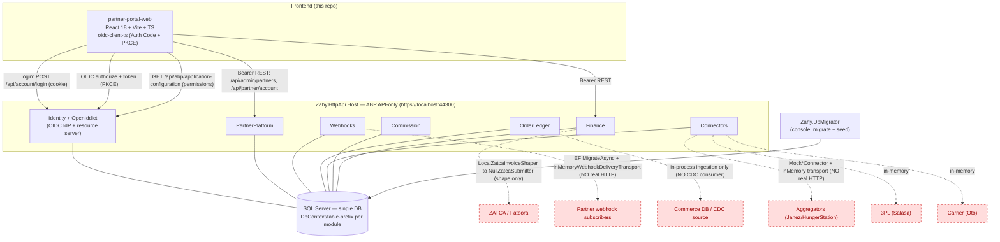
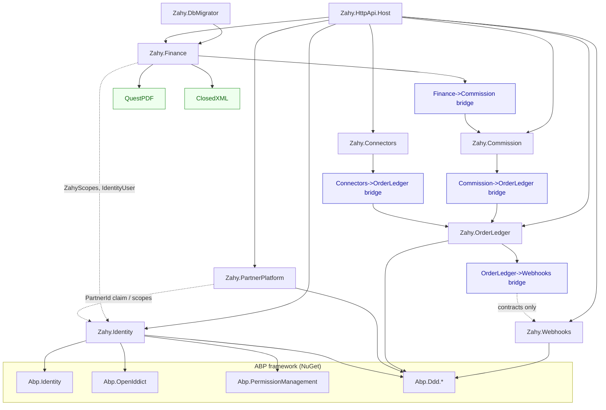
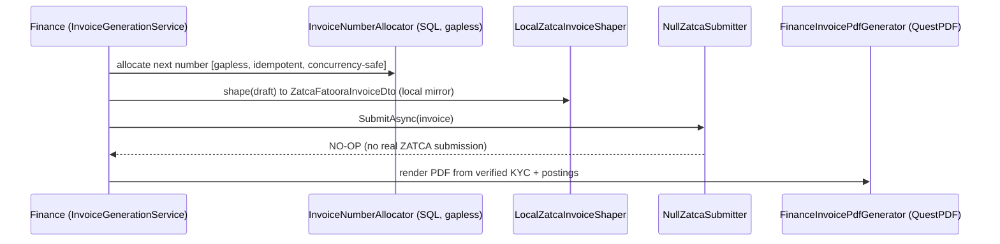
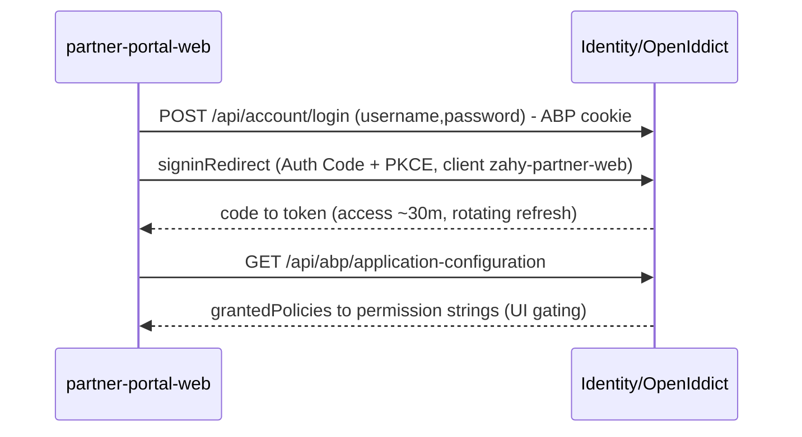

# Zahy Partner Platform — Architecture & Gap-Analysis Audit

**Audit date:** 2026-06-19
**Auditor:** Senior architect (read-only code audit)
**Repository:** `partner-portal` (branch `feat/partner-merchant-finance`, + uncommitted WIP)
**Method:** Static read of source only. Nothing built, run, or migrated. Connection-string *values* are deliberately not reproduced here.

> **Scope reality check (read first).** The task brief lists a broad "Zahy platform" (Angular admin, React POS, merchant dashboard, makookapp **Commerce/Promotions/Shipping.Oto** as compiled NuGet packages, ZATCA/Fatoora, payment gateways, GCP/Cloud Run, CDC from Commerce). **Almost none of that is code in *this* repository.** This repo is the *physically separate Partner Platform*: one ABP **API-only** .NET backend + **one** React SPA. The wider platform is **context from the design docs** (`.cursorrules`, `README.md`, the `*.docx` files), not code here. Every such item is marked **NOT VERIFIED IN CODE** and listed in the final section. I did not invent any component.

---

## 1. Executive Summary

**What this repo is today.** A .NET 10 / **ABP 10.4.1** modular-monolith backend exposing REST + OpenIddict (OIDC), plus a **React 18 + Vite + TypeScript** single-page partner portal. It implements an owned **Identity/IdP**, **Partner onboarding**, **Webhooks** (outbox/HMAC/retry/DLQ), an **Order Ledger**, **Connectors** (aggregator / 3PL / carrier abstraction), **Commission** (append-only ledger + billing), and **Finance** (KYC → accounts → postings → invoicing → portal). It is **not** a scaffold — there are 24 persisted entity types, 9 EF migrations, and 203 passing tests (per the separate verification pass). The code is real and substantially complete for the partner/finance domain.

**Stack.** .NET 10 · ABP 10.4.1 · EF Core 10 (SQL Server) · OpenIddict (Auth Code+PKCE for users, Client-Credentials for partner M2M) · QuestPDF (invoices) · ClosedXML (XLSX) · React 18 / Vite 6 / TS / Tailwind / shadcn / `oidc-client-ts`. Single SQL Server database, **DbContext + table-prefix per module** (modular monolith).

**Top 5 findings / risks.**
1. **All external edges are in-memory/mock seams, by design.** Connectors are `Mock*Connector` over `InMemory*ConnectorTransport`; webhook delivery uses `InMemoryWebhookDeliveryTransport`; ZATCA submission is `NullZatcaSubmitter`; order capture is an in-process service (no SQL Server CDC). The *domain logic* is real and tested; the *real-world integrations are not wired*. (§6, §8)
2. **No vendor source, and the vendor packages aren't even referenced here.** makookapp Commerce/Promotions/Shipping.Oto/Tajer are **absent** from every `.csproj` — they are neither delivered as source nor consumed as compiled packages in this repo. Any "outside-in via ACL" integration is **not yet present in code**. (§9)
3. **ZATCA/Fatoora e-invoicing is shape-only.** `LocalZatcaInvoiceShaper` builds a local mirror of the Fatoora DTO, but submission is a no-op (`NullZatcaSubmitter`). KSA compliance (signing, clearance/reporting) is **not implemented**. (§6, §8)
4. **KYC field protection is explicitly dev-grade.** `DevAppLayerKycFieldProtector` does real AES-GCM but with dev key management ("not a production crypto decision"). PII-at-rest needs a real KMS/HSM before production. (§9)
5. **Finance & Commission are pending CTO/finance review** (per `.cursorrules`), and a known **OAuth-scope discrepancy** exists (Marketplace partners get `catalog:read`, not `catalog:write`) — a deliberate conservative default that may or may not match intent. (§8, §9)

---

## 2. Solution & Folder Tree

Labels: **[OWNED]** = first-party source in this repo · **[GENERATED]** = EF migrations / build output · **[VENDOR-BLACKBOX]** = compiled third-party with no source. **No VENDOR-BLACKBOX packages are referenced in this repo** (see §9).

```
partner-portal/
├─ Zahy.PartnerPlatform.slnx                         [OWNED] solution
├─ .cursorrules / README.md / *.docx                [OWNED] design docs (context, not code)
├─ src/
│  ├─ Directory.Build.props / Directory.Packages.props   [OWNED] net10 + central pkg versions
│  ├─ Zahy.Identity/                                 [OWNED] owned IdP (ABP Identity + OpenIddict)
│  │   └─ Domain.Shared · Domain · Application.Contracts · Application · EntityFrameworkCore · HttpApi
│  ├─ Zahy.PartnerPlatform/                          [OWNED] partner aggregates, onboarding, team
│  ├─ Zahy.Webhooks/                                 [OWNED] subscriptions, outbox, HMAC, retry, DLQ
│  ├─ Zahy.OrderLedger/                              [OWNED] append-only order capture + ledger
│  ├─ Zahy.Connectors/                               [OWNED] aggregator/3PL/carrier abstraction (MOCK adapters)
│  ├─ Zahy.Commission/                               [OWNED] rules, append-only ledger, billing
│  ├─ Zahy.Finance/                                  [OWNED] KYC, accounts, postings, invoicing, portal
│  │   └─ …/EntityFrameworkCore/Migrations/          [GENERATED] EF migrations
│  ├─ Zahy.HttpApi.Host/                             [OWNED] API-only host (composition root, OIDC, CORS)
│  └─ Zahy.DbMigrator/                               [OWNED] console migrator + data seeder
├─ test/                                             [OWNED] 8 xUnit projects (Identity, PartnerPlatform,
│   │                                                         Webhooks, OrderLedger, Connectors, Commission,
│   │                                                         Finance, PlatformIntegration)
└─ frontend/
   └─ partner-portal-web/                            [OWNED] React 18 + Vite + TS + Tailwind + shadcn SPA
```

Each `Zahy.<Module>` follows the ABP layering: `Domain.Shared`, `Domain`, `Application.Contracts`, `Application`, `EntityFrameworkCore`, and (most) `HttpApi`. `Zahy.Connectors` has **no HttpApi** project (it is driven internally / by ingestion, not a public controller surface).

---

## 3. System Architecture Diagram



> Dashed red nodes = external systems referenced by the design but **reached only through mock/in-memory/null seams in code** (no live integration). Solid edges are verified in code.

---

## 4. Module Dependency Tree



**Key facts (cited):**
- **Bridge modules use a null-object pattern** so domains stay decoupled and are wired only when co-hosted:
  - `ZahyOrderLedgerWebhooksModule` swaps `NullOrderLedgerWebhookNotifier` → `OrderLedgerWebhookNotifier` ([ZahyOrderLedgerWebhooksModule.cs](src/Zahy.OrderLedger/Zahy.OrderLedger.Application/ZahyOrderLedgerWebhooksModule.cs)).
  - `ZahyConnectorsOrderLedgerModule`, `ZahyCommissionOrderLedgerModule`, `ZahyFinanceCommissionModule` similarly bridge ingestion → ledger → commission → finance.
- **Only non-Microsoft/non-Volo packages:** `QuestPDF` and `ClosedXML`, isolated to `Zahy.Finance.Application` ([Directory.Packages.props:40](src/Directory.Packages.props)).
- **No makookapp / Commerce / Promotions / Oto / Tajer references** in any `.csproj`.

---

## 5. Database / ER Diagram

Single SQL Server DB; each module owns a DbContext and a **table prefix** (`Zahy*`, `Whk*`, `Olg*`, `Conn*`, `Com*`, `Fin*`). All 9 migrations apply into one database (modular monolith, per `.cursorrules §4`).

**Multi-tenancy:** shared DB + `TenantId` column via ABP `IMultiTenant` for *merchant/tenant*-scoped data; *partner* aggregates are host-level (`TenantId` null) and isolated by a **`PartnerId`** column enforced through **custom EF query filters** (e.g. Finance `HasQueryFilter` on `CurrentPartnerId`/`FinanceCurrentTenantId` in [ZahyFinanceDbContext.cs](src/Zahy.Finance/Zahy.Finance.EntityFrameworkCore/ZahyFinanceDbContext.cs); `IConnectorPartnerDataFilter`).

```mermaid
erDiagram
    AbpUsers ||--o{ ZahyPartnerUsers : "IdentityUserId (ABP / external schema)"
    ZahyPartners ||--o{ ZahyPartnerUsers : "PartnerId"
    ZahyPartners ||--o{ WhkSubscriptions : "PartnerId"
    WhkSubscriptions ||--o{ WhkDeliveries : "SubscriptionId"
    WhkOutboxMessages ||--o{ WhkDeliveries : "OutboxMessageId"
    WhkOutboxMessages ||--o| WhkDeadLetters : "OutboxMessageId"
    OlgOrderRecords ||--o{ OlgOrderLines : "OrderRecordId"
    OlgOrderRecords ||--o{ ComLedgerEntries : "OrderRecordId (nullable)"
    ComRules ||--o{ ComLedgerEntries : "RuleId"
    ComLedgerEntries ||--o| ComLedgerEntries : "ReversesEntryId (self)"
    FinKycVerifications ||--|| FinPartnerAccounts : "KycVerificationId"
    FinKycVerifications ||--|| FinMerchantAccounts : "KycVerificationId"
    FinKycSubmissions ||--|| FinKycVerifications : "KycSubmissionId"
    FinPartnerAccounts ||--o{ FinAccountPostings : "AccountId (Partner)"
    FinMerchantAccounts ||--o{ FinAccountPostings : "AccountId (Merchant)"

    ZahyPartners {
        Guid Id PK
        Guid TenantId "nullable (IMultiTenant; host-level=null)"
        enum Type
        enum Status
        string LegalName
        string OpenIddictClientId "set on approve (M2M)"
    }
    ZahyPartnerUsers {
        Guid Id PK
        Guid PartnerId FK
        Guid IdentityUserId FK
        enum Status
    }
    WhkSubscriptions {
        Guid Id PK
        Guid PartnerId "scope key"
        string TargetUrl
        string SigningSecret "HMAC"
        enum Status
    }
    WhkOutboxMessages {
        Guid Id PK
        Guid PartnerId
        string IdempotencyKey UK
        enum Status "Pending/Processing/Completed/DeadLettered"
        int AttemptCount
    }
    WhkDeliveries {
        Guid Id PK
        Guid OutboxMessageId FK
        Guid SubscriptionId FK
        int AttemptNumber
        int HttpStatusCode
    }
    WhkDeadLetters {
        Guid Id PK
        Guid OutboxMessageId FK_UK
        string Reason
    }
    OlgOrderRecords {
        Guid Id PK
        Guid TenantId "merchant scope (nullable)"
        Guid PartnerId "partner scope (nullable)"
        string SourceOrderId
        long SourceVersion "idempotency/versioning"
        enum Status
        enum PaymentStatus
        decimal Subtotal "commission basis"
        decimal TotalAmount
    }
    OlgOrderLines {
        Guid Id PK
        Guid OrderRecordId FK
        string Sku
        decimal LineTotal
    }
    ConnRegistrations {
        Guid Id PK
        Guid PartnerId
        Guid TenantId
        string ConnectorCode
        string SecretReference "vault ref, not secret"
    }
    ConnBranchMappings {
        Guid Id PK
        Guid PartnerId
        Guid TenantId
        string ExternalOutletId
        Guid InternalOutletId
    }
    ComRules {
        Guid Id PK
        enum Direction "PlatformEarns/PartnerEarns"
        enum FeeType
        enum BasisAmountKind "Subtotal/Total/Custom"
        int Priority
    }
    ComLedgerEntries {
        Guid Id PK
        Guid PartnerId
        Guid RuleId FK
        Guid OrderRecordId "nullable FK"
        decimal BasisAmount
        decimal ComputedCommission
        enum EntryKind "Accrual/Reversal"
        Guid ReversesEntryId "nullable self"
        string IdempotencyKey UK
    }
    ComBillingCharges {
        Guid Id PK
        Guid PartnerId
        enum ChargeTarget "Partner/Merchant"
        decimal Amount
        string IdempotencyKey UK
    }
    ComPartnerBillingProfiles {
        Guid Id PK
        Guid PartnerId UK
        decimal MonthlySubscriptionAmount
    }
    FinPartnerAccounts {
        Guid Id PK
        Guid PartnerId UK
        enum Status
        Guid KycVerificationId FK
        datetime OpenedAt
    }
    FinMerchantAccounts {
        Guid Id PK
        Guid TenantId UK "IMultiTenant"
        enum Status
        Guid KycVerificationId FK
    }
    FinAccountPostings {
        Guid Id PK
        enum AccountKind "Partner/Merchant"
        Guid AccountId
        Guid PartnerId "nullable scope"
        Guid TenantId "nullable scope"
        decimal PostingAmount "signed; balance=SUM (no stored balance)"
        string IdempotencyKey UK
        Guid ReversesPostingId "nullable"
    }
    FinKycSubmissions {
        Guid Id PK
        enum EntityKind
        Guid EntityId
        int Version
        string ProtectedIban "AES-GCM (dev protector)"
    }
    FinKycVerifications {
        Guid Id PK
        Guid KycSubmissionId FK_UK
        enum Status "Submitted/UnderReview/Verified/Rejected"
        string VerifiedIban "canonical, post-verify"
    }
    FinDocuments {
        Guid Id PK
        enum DocumentKind
        string InvoiceNumber "gapless per fiscal year"
        int FiscalYear
        int SequenceNumber
        string IdempotencyKey UK
    }
    FinInvoiceNumberSequences {
        Guid Id PK
        enum DocumentKind
        int FiscalYear
        int LastNumber
    }
```

> **External/unknown schema:** ABP-provided tables (`AbpUsers`, `AbpRoles`, `OpenIddictApplications/Scopes`, permission tables) are created by ABP modules and **not redefined here** — flagged ABP-managed. Any *Commerce* schema (the order source of truth in the wider platform) is **external/unknown — NOT in this repo**.

---

## 6. Connectors & Integrations Inventory

Status legend: **LIVE** (real external call) · **PARTIAL** · **STUBBED/MOCK** (canned/in-memory, no external call) · **CONFIG-ONLY/SEAM** (interface, no real impl) · **MISSING**.

| Integration | Purpose | Where in code | Direction | Status |
|---|---|---|---|---|
| Connector abstraction (registry, capabilities, canonical order) | Unified partner-system interface | `IConnectorRegistry`, `IPartnerConnector`, `ICanonicalOrderMapper`, `ConnectorRegistry.cs`, `CanonicalOrderMapper.cs` | internal | **LIVE (in-process)** |
| Aggregator (Jahez / HungerStation) | Inbound delivery orders + accept/SLA | `Aggregators/MockAggregatorConnector.cs` + `Transports/InMemoryAggregatorConnectorTransport.cs` | in | **STUBBED/MOCK** (no real HTTP) |
| 3PL fulfilment (Salasa) | Returns, inventory reconcile | `ThreePL/MockThreePLConnector.cs` + `InMemoryThreePLConnectorTransport.cs` | in/out | **STUBBED/MOCK** |
| Carrier (Oto) | Rates, labels, tracking | `Carriers/MockCarrierConnector.cs` + `InMemoryCarrierConnectorTransport.cs` | in/out | **STUBBED/MOCK** |
| Acceptance / SLA policy | Block accept after deadline | `Aggregators/AcceptancePolicyEvaluator.cs` | internal | **LIVE** |
| Order capture → ledger | Idempotent ingest (id+version) | `Connectors/.../ConnectorOrderIngestionService.cs` → `OrderLedger/.../OrderLedgerIngestionService.cs` | in | **LIVE (in-process)** |
| **SQL Server CDC from Commerce** | Order source of truth | — | in | **MISSING** (design calls for CDC; only in-process ingest exists) |
| Webhook pipeline (HMAC, outbox, retry, DLQ) | Outbound partner events | `Webhooks/WebhookDeliveryProcessor.cs`, `WebhookHmacSigner`, outbox/DLQ entities | out | **LIVE (logic)** |
| Webhook HTTP delivery transport | Actual POST to subscriber URL | `Webhooks/InMemoryWebhookDeliveryTransport.cs` (registered in `ZahyWebhooksApplicationModule.cs`) | out | **STUBBED** (in-memory; no real HTTP) |
| Auth / OIDC IdP | User + partner-M2M auth | `Zahy.Identity` (OpenIddict): Auth Code+PKCE SPA clients, Client-Credentials M2M | in/out | **LIVE** |
| ZATCA/Fatoora invoice **shaping** | Build Fatoora invoice DTO | `Finance/.../FinanceDocumentServices.cs` → `LocalZatcaInvoiceShaper` | internal | **PARTIAL** (shape only) |
| ZATCA/Fatoora **submission** | Clear/report e-invoice | `NullZatcaSubmitter` (registered in `ZahyFinanceApplicationModule.cs`) | out | **CONFIG-ONLY/NO-OP** |
| Invoice PDF | Generate invoice PDF | `Finance/.../FinanceInvoicePdfGenerator.cs` (QuestPDF) | out (file) | **LIVE** |
| Statement exports CSV/XLSX | Account statement export | `Finance/.../FinanceExportGenerators.cs` (ClosedXML) | out (file) | **LIVE** |
| KYC field protection (PII at rest) | Encrypt CR/VAT/IBAN | `Finance/Kyc/DevAppLayerKycFieldProtector.cs` (AES-GCM) | internal | **PARTIAL (dev-grade)** |
| Payment gateway(s) | Collect/settle money | — | — | **MISSING / NOT IN CODE** |
| Cloud storage (GCP/S3/Blob) | Store generated docs | — | — | **MISSING / NOT IN CODE** |
| Email / SMS | Notifications | — | — | **MISSING / NOT IN CODE** |
| GCP / Cloud Run | Hosting/infra | — | — | **NOT VERIFIED IN CODE** (no infra/IaC in repo) |
| makookapp Commerce / Promotions / Shipping.Oto | Vendor commerce engine | — | — | **NOT IN REPO** (not referenced as source or package) |

---

## 7. Core Data Flows

> The brief's POS-sale, e-commerce-fulfilment, and tenant-creation flows are **not implemented in this repo** (POS/e-commerce live in core Zahy; see §11). Below are the flows that **exist in code**, each with an explicit starting point. The `Null`/`InMemory`/mock steps mark the seams where a real external system would attach.

### 7a. Inbound connector order → ledger → commission → finance → webhook
**Starting point:** an aggregator delivers an order into `MockAggregatorConnector` (in a live system: a Jahez/HungerStation webhook or poll).

```mermaid
sequenceDiagram
    participant AGG as Aggregator (MOCK transport)
    participant CN as Connectors (CanonicalOrderMapper)
    participant OL as OrderLedger (IngestionService)
    participant CM as Commission (Accrual)
    participant FI as Finance (PostingIngestion)
    participant WH as Webhooks (Outbox to Transport)
    participant SUB as Partner subscriber (IN-MEMORY)

    AGG->>CN: receive order (canonical)
    CN->>OL: ingest(sourceId, version) [idempotent]
    OL-->>OL: append OrderRecord (no mutate); skip if dup
    OL->>CM: OrderLedgerCommissionTrigger (bridge)
    CM-->>CM: resolve winning rule, accrue on Subtotal (append-only)
    CM->>FI: CommissionLedgerFinanceTrigger (bridge)
    FI-->>FI: append AccountPosting (signed; balance=SUM)
    OL->>WH: OrderLedgerWebhookNotifier (bridge) enqueue outbox
    WH->>WH: HMAC sign; retry; DLQ on max attempts
    WH-->>SUB: deliver via InMemoryWebhookDeliveryTransport (NO real HTTP)
```

### 7b. Partner onboarding → approve → M2M credential
**Starting point:** admin approves a pending partner in `PartnersPage` → `POST /api/admin/partners/{id}/approve`.

```mermaid
sequenceDiagram
    participant ADM as Admin SPA
    participant PP as PartnerPlatform (PartnerAdminAppService)
    participant ID as Identity/OpenIddict (M2M provisioner)
    ADM->>PP: ApproveAsync(partnerId)
    PP-->>PP: guard - status transition legal? BankInfo present?
    PP->>ID: provision confidential M2M client (scopes by PartnerType)
    ID-->>PP: clientId + one-time clientSecret
    PP-->>PP: persist OpenIddictClientId; rollback all on failure (atomic)
    PP-->>ADM: secret returned ONCE (never logged/stored)
```

### 7c. Finance invoice generation → ZATCA shaping → PDF
**Starting point:** invoice generation for an account period (`FinanceInvoiceGenerationService`).



### 7d. SPA login (owned cookie + OIDC PKCE)
**Starting point:** user submits credentials on `LoginScreen`.



---

## 8. Gap Analysis

| Capability | Status | Evidence | Risk if left as-is |
|---|---|---|---|
| Owned IdP (OIDC, PKCE, M2M, MFA-ready) | **DONE** | `Zahy.Identity`, OpenIddict seed, token policy in `ZahyHostModule` | Low. MFA is a seam (flagged off), not enabled. |
| Partner onboarding lifecycle + M2M | **DONE** | `PartnerPlatform` services + tests | Low |
| Tenant isolation (tenant + partner) | **DONE** | `IMultiTenant` + `PartnerId` query filters | Med — partner filters are custom; review per new entity |
| Order Ledger (append-only, idempotent) | **DONE** | `OlgOrderRecords`, `OrderLedgerIngestionService` | Low for logic |
| **Order capture from Commerce (CDC)** | **MISSING** | No CDC consumer; only in-process ingest | **High** — no real order source wired |
| Connector framework (registry/canonical/SLA) | **DONE** | `Zahy.Connectors` abstraction | Low |
| **Real partner adapters (Jahez/HS/Salasa/Oto)** | **MISSING** | only `Mock*Connector` + in-memory transports | **High** — no live partner traffic |
| Webhooks (HMAC, outbox, retry, DLQ) | **DONE (logic)** | `Webhooks` module + tests | Med |
| **Real webhook HTTP delivery** | **STUBBED** | `InMemoryWebhookDeliveryTransport` is the registered transport | **High** — subscribers never actually called |
| Commission (rules, append-only, billing) | **DONE** | `Zahy.Commission` + tests | Med — pending finance review |
| Finance (KYC→accounts→postings→invoice→portal) | **DONE** | `Zahy.Finance` + tests | Med — pending finance review |
| **ZATCA/Fatoora submission (KSA compliance)** | **CONFIG-ONLY** | `NullZatcaSubmitter` registered | **High** — not legally compliant for e-invoicing |
| **KYC PII at rest (KMS/HSM)** | **PARTIAL** | `DevAppLayerKycFieldProtector` (dev key) | **High** — dev crypto for regulated PII |
| Payments | **MISSING** | no gateway code | **High** if money movement is in scope |
| Storage / Email / SMS | **MISSING** | no clients/config | Med |
| Vendor Commerce/Promotions/Oto integration | **BLACK-BOX / NOT IN REPO** | absent from all `.csproj` | **High** — integration surface undefined in code |
| Angular admin / React POS / merchant dashboard | **NOT IN REPO** | only `partner-portal-web` | N/A here (separate repos) |
| Marketplace `catalog:write` scope | **PARTIAL/By design** | `PartnerTypeScopePolicy.cs` maps `[OrdersRead, CatalogRead]` | Med — may mismatch intent (Architect decision) |
| Automated tests | **DONE** | 8 backend xUnit projects + frontend vitest (203 passing) | Low |

---

## 9. Risks & Technical Debt

1. **External integrations are all seams.** CDC, partner adapters, webhook HTTP, and ZATCA submission are mock/in-memory/null. The platform cannot exchange data with any real external system today. This is the single largest gap between "tests green" and "production-ready." (§6, §8)
2. **Vendor source not delivered — and not even referenced.** makookapp Commerce/Promotions/Shipping.Oto/Tajer appear in the design docs as compiled packages, but **no `.csproj` references them**. The anti-corruption layer / outside-in contracts described in `.cursorrules` are **not present in code**. Integration design is unverifiable here.
3. **KSA regulatory readiness.** ZATCA/Fatoora is shape-only (`NullZatcaSubmitter`); no signing/clearance/reporting. E-invoicing is a legal requirement in KSA — must be real before go-live.
4. **PII / KYC crypto is dev-grade.** `DevAppLayerKycFieldProtector` is explicitly "not a production crypto decision." CR/VAT/IBAN are regulated PII; production needs managed keys (KMS/HSM), rotation, and access audit.
5. **Config footgun (from prior verification).** Host base `appsettings.json` and `appsettings.Development.json` point at different databases; only Development aligns with the DbMigrator. Running the host outside Development silently targets an unseeded DB. (Connection-string values intentionally not printed here.)
6. **Dependency advisory.** `System.Security.Cryptography.Xml 9.0.0` carries a high-severity advisory (NU1903) and is pulled into host-shipping EF/OpenIddict projects — recommend a transitive bump.
7. **Money/Finance pending review.** Commission + Finance are flagged in `.cursorrules` as pending CTO/finance sign-off; the `catalog:write` scope discrepancy is unresolved.
8. **OneDrive working path.** The repo lives under a OneDrive-synced path; NuGet restore over the network was the dominant build-time cost in the separate verification pass. A developer-experience and CI-reliability risk, not an architecture one.

---

## 10. Recommended Roadmap

**P0 — now (unblocks any real traffic / compliance):**
- **Wire one real partner adapter end-to-end** (replace a `Mock*Connector`/in-memory transport with a real HTTP client behind the same interface) to prove the abstraction against a live API.
- **Real webhook HTTP transport** (swap `InMemoryWebhookDeliveryTransport` for an `HttpClient`-based sender; keep HMAC/outbox/retry/DLQ as-is).
- **Order capture from Commerce** (implement the CDC consumer the design specifies, feeding `OrderLedgerIngestionService`).
- **ZATCA submission** (implement `IZatcaSubmitter` against Fatoora incl. signing/clearance) — regulatory blocker.
- **Production KYC key management** (replace dev protector with KMS/HSM-backed `IKycFieldProtector`).
- Resolve the **`catalog:write`** scope question and the **appsettings DB mismatch**; bump the **NU1903** dependency.

**P1 — next (make it operable):**
- Payments integration (if money movement is in scope), storage for generated PDFs, email/SMS for partner/merchant notifications.
- Define the **vendor ACL** in code: the contracts/interfaces this repo will use to talk to compiled Commerce/Promotions/Oto, even if the packages aren't yet present.
- Background processing for the webhook outbox/retry loop (background workers are currently disabled in the host).
- MFA step-up activation (the seam exists).

**P2 — later (scale / hardening):**
- Per-tenant DB option for large clients (design allows it; not implemented).
- Observability (structured logs/metrics/tracing); CI that warms the NuGet cache / runs off a non-OneDrive path.
- Promote a real client-side router and harden the SPA session/permission model.

---

## 11. Assumptions & "NOT VERIFIED IN CODE"

**Assumptions made (stated explicitly):**
- "Module is DONE/LIVE" means the in-process logic exists and is covered by tests; it does **not** imply a live external connection. I drew that line at the registered DI implementation (mock/in-memory/null ⇒ not LIVE).
- The single SQL Server database hosting all module schemas is inferred from per-module DbContexts + one combined migration history (`.cursorrules §4`); I did not query a live DB for this audit.
- Table names come from `ToTable(...)` in each DbContext (verified by reading). Entity field lists are representative key fields, not exhaustive column dumps.
- Frontend API/OIDC config values are read from `src/lib/auth/*` and `.env`; I did **not** print `.env` contents.

**NOT VERIFIED IN CODE (blind spots for the CTO):**
- **Angular admin app, React POS, React merchant dashboard** — none exist in this repo; only `partner-portal-web`.
- **makookapp Commerce, Promotions, Shipping.Oto, Tajer.*** — not referenced as source or NuGet package anywhere; integration surface undefined in code.
- **SQL Server CDC** consumer from Commerce — design only; no code.
- **ZATCA/Fatoora live submission**, **payment gateway(s)**, **cloud storage**, **email/SMS** — no implementations.
- **GCP / Cloud Run / any infrastructure-as-code** — no infra, Dockerfile, or deployment manifests found in repo.
- **Promotions, Catalog, Theming, CmsKit, EInvoicing.ZatcaFatoora, Payments owned modules** named in `.cursorrules` — **not present in this repo** (this repo is only the Partner Platform).
- **POS polling (~10–15s) / SLA accept window** behavior — the acceptance-policy logic exists in code, but the POS that polls it is external and not verifiable here.
- **MFA** — referenced and seam-ready, but disabled; real second-factor flow not implemented.
- **Production hosting topology, caches, queues** (Redis/RabbitMQ/Kafka) — none referenced in code.
```
